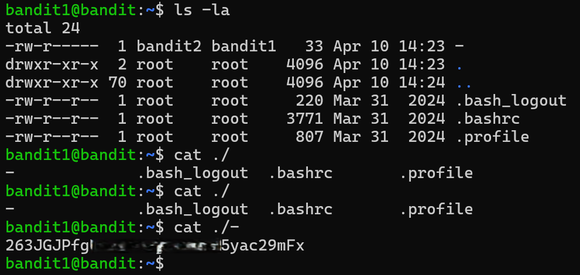

# Bandit Level 1 → Level 2

## Level Goal / Objective

The password for the next level is stored in a file called `-` located in the home directory.

🔗 https://overthewire.org/wargames/bandit/bandit2.html

## Commands You May Need

```text
ls , cd , cat , file , du , find
```

## Concept Focus

* Handling special filenames in Linux
* Understanding how the shell interprets `-` as stdin/stdout

## Approach

### 1. Connect to the Level

```bash
ssh bandit1@bandit.labs.overthewire.org -p 2220
```

Authenticated using the password obtained from the previous level.

---

### 2. Enumerate the Environment

```bash
ls -la
```

The directory listing reveals a file named:

```text
-
```

This is a special filename that can cause issues when used directly in commands.

---

### 3. Identify the Target

Attempting to read the file directly:

```bash
cat -
```

This does not work as expected because `-` is interpreted by the shell as standard input.

---

### 4. Extract the Password

Use a relative path to explicitly reference the file:

```bash
cat ./-
```

This forces the shell to treat `-` as a filename rather than stdin, allowing the contents to be displayed.

---

## Walkthrough (Screenshots)



---

## Password for Level 2

```text
263JGJPf...yac29mFx
```

---

## Key Takeaways

* Filenames like `-` are treated specially in Unix-like systems
* Prefixing with `./` ensures the shell interprets it as a file
* Understanding shell parsing behavior is critical for edge cases
