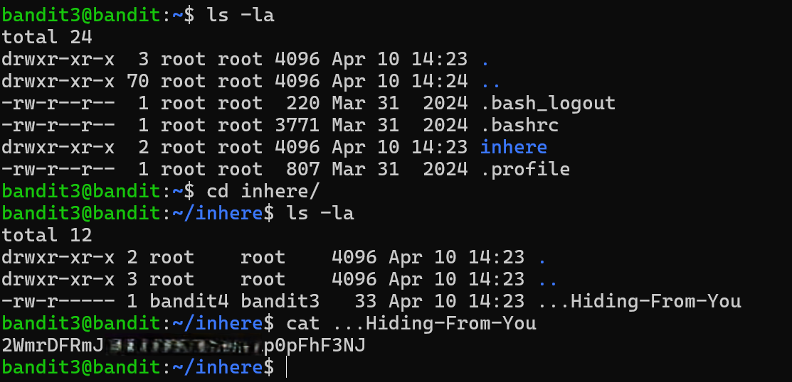

# Bandit Level 3 → Level 4

## Level Goal / Objective

The password for the next level is stored in a hidden file in the `inhere` directory.

🔗 https://overthewire.org/wargames/bandit/bandit4.html

## Commands You May Need

```text
ls , cd , cat , file , du , find
```

## Concept Focus

* Navigating directories
* Identifying hidden files
* Using flags like `-a` to reveal hidden content

## Approach

### 1. Connect to the Level

```bash
ssh bandit3@bandit.labs.overthewire.org -p 2220
```

Authenticated using the password obtained from the previous level.

---

### 2. Enumerate the Environment

```bash
ls -la
```

The listing reveals a directory named:

```text
inhere
```

---

### 3. Navigate to Target Directory

```bash
cd inhere
```

List contents again:

```bash
ls -la
```

A hidden file is revealed:

```text
...Hiding-From-You
```

---

### 4. Extract the Password

```bash
cat ...Hiding-From-You
```

The file contains the password for the next level.

---

## Walkthrough (Screenshots)



---

## Password for Level 4

```text
2WmrDFRm...pFhF3NJ
```

---

## Key Takeaways

* Hidden files require `-a` flag to be visible
* Directory traversal is essential for enumeration
* Always inspect subdirectories when nothing obvious is present
