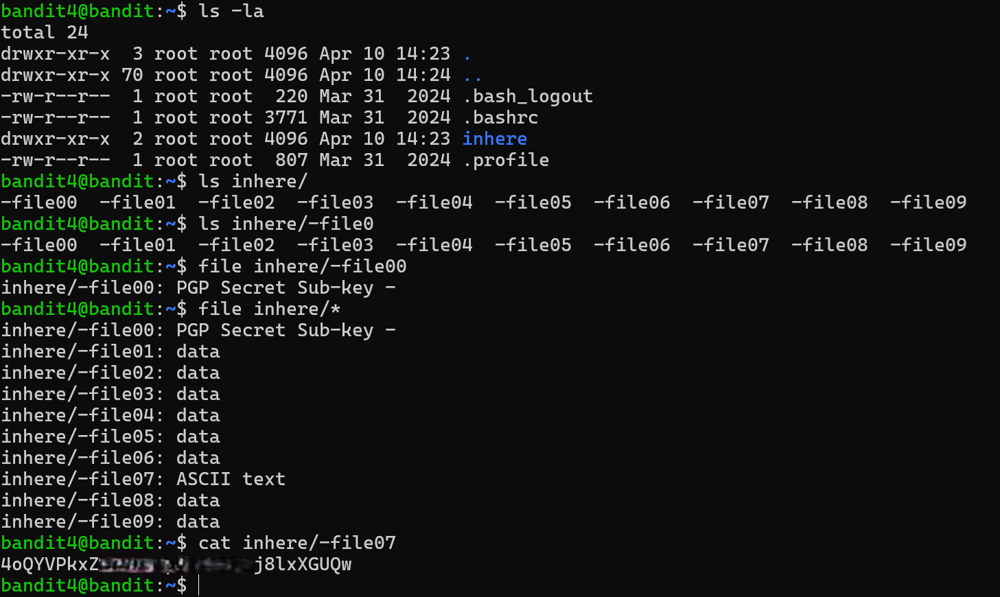

# Bandit Level 4 → Level 5

## Level Goal / Objective

The password for the next level is stored in the only human-readable file in the `inhere` directory.

🔗 https://overthewire.org/wargames/bandit/bandit5.html

## Commands You May Need

```text
ls , cd , cat , file , du , find
```

## Concept Focus

* Identifying file types
* Using the `file` command
* Filtering for human-readable content

## Approach

### 1. Connect to the Level

```bash
ssh bandit4@bandit.labs.overthewire.org -p 2220
```

Authenticated using the password obtained from the previous level.

---

### 2. Enumerate the Environment

```bash
ls -la
```

Navigate to the target directory:

```bash
cd inhere
```

List files:

```bash
ls
```

---

### 3. Identify the Target

Check file types:

```bash
file inhere/*
```

Most files return `data`, but one file is identified as:

```text
ASCII text
```

---

### 4. Extract the Password

```bash
cat inhere/-file07
```

The file contains the password for the next level.

---

## Walkthrough (Screenshots)



---

## Password for Level 5

```text
4oQYVPkx...lxXGUQw
```

---

## Key Takeaways

* The `file` command is useful for identifying readable files
* Not all files are human-readable by default
* Filtering based on file type is an effective enumeration technique
