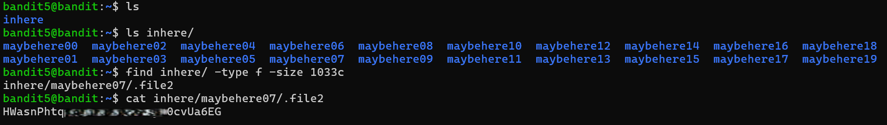

# Bandit Level 5 → Level 6

## Level Goal / Objective

The password for the next level is stored in a file somewhere under the `inhere` directory and has all of the following properties:
- human-readable
- 1033 bytes in size
- not executable

🔗 https://overthewire.org/wargames/bandit/bandit6.html

## Commands You May Need

```text
ls , cd , cat , file , du , find
```

## Concept Focus

* Using `find` for targeted searches
* Filtering files by size and type
* Efficient enumeration of large directories

## Approach

### 1. Connect to the Level

```bash
ssh bandit5@bandit.labs.overthewire.org -p 2220
```

Authenticated using the password obtained from the previous level.

---

### 2. Enumerate the Environment

```bash
ls
```

Navigate to the target directory:

```bash
ls inhere/
```

The directory contains multiple subdirectories (`maybehereXX`).

---

### 3. Identify the Target

Use `find` to locate files matching the required criteria:

```bash
find inhere/ -type f -size 1033c
```

This returns a single file:

```text
inhere/maybehere07/.file2
```

---

### 4. Extract the Password

```bash
cat inhere/maybehere07/.file2
```

The file contains the password for the next level.

---

## Walkthrough (Screenshots)



---

## Password for Level 6

```text
HWasnPht...cvUa6EG
```

---

## Key Takeaways

* `find` is powerful for narrowing down files based on attributes
* Combining filters (size, type) avoids manual searching
* Efficient enumeration is critical when dealing with many files
