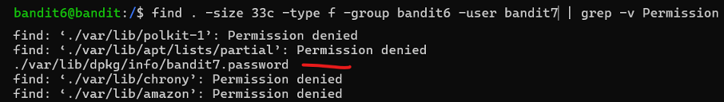

# Bandit Level 6 → Level 7

## Level Goal / Objective

The password for the next level is stored somewhere on the server and has all of the following properties:
- owned by user bandit7
- owned by group bandit6
- 33 bytes in size

🔗 https://overthewire.org/wargames/bandit/bandit7.html

## Commands You May Need

```text
ls , cd , cat , file , du , find , grep
```

## Concept Focus

* Searching across the filesystem
* Using `find` with multiple filters (user, group, size)
* Handling permission errors

## Approach

### 1. Connect to the Level

```bash
ssh bandit6@bandit.labs.overthewire.org -p 2220
```

Authenticated using the password obtained from the previous level.

---

### 2. Identify the Target

Search the entire filesystem with the required constraints:

```bash
find / -size 33c -type f -user bandit7 -group bandit6 2>/dev/null
```

This suppresses permission denied errors and returns the matching file.

---

### 3. Extract the Password

```bash
cat /var/lib/dpkg/info/bandit7.password
```

The file contains the password for the next level.

---

## Walkthrough (Screenshots)



---

## Password for Level 7

```text
morbNTDk...lFVAaj
```

---

## Key Takeaways

* `find` can search the entire filesystem using multiple filters
* Redirecting errors (`2>/dev/null`) helps clean output
* Understanding file ownership is key for targeted searches
