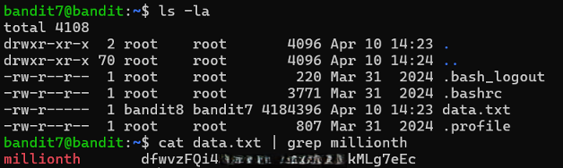

# Bandit Level 7 → Level 8

## Level Goal / Objective

The password for the next level is stored in the file `data.txt` next to the word `millionth`.

🔗 https://overthewire.org/wargames/bandit/bandit8.html

## Commands You May Need

```text
ls , cd , cat , file , du , find , grep
```

## Concept Focus

* Searching file contents
* Using `grep` for pattern matching
* Working with large text files

## Approach

### 1. Connect to the Level

```bash
ssh bandit7@bandit.labs.overthewire.org -p 2220
```

Authenticated using the password obtained from the previous level.

---

### 2. Enumerate the Environment

```bash
ls -la
```

The directory contains a large file:

```text
data.txt
```

---

### 3. Identify the Target

Search for the keyword `millionth` within the file:

```bash
cat data.txt | grep millionth
```

This returns the line containing the password.

---

### 4. Extract the Password

The password appears next to the keyword in the output.

---

## Walkthrough (Screenshots)



---

## Password for Level 8

```text
dfwvzFQi...MLg7eEc
```

---

## Key Takeaways

* `grep` is essential for searching within files
* Piping (`|`) allows combining commands effectively
* Efficient text searching is critical for large datasets
