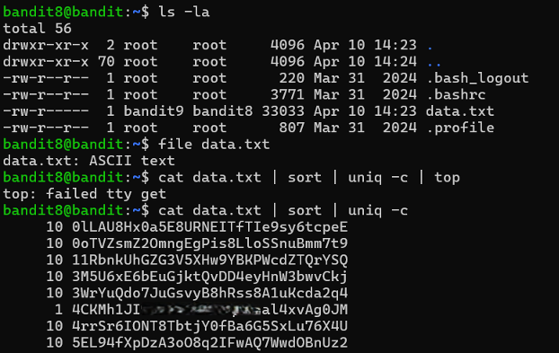

# Bandit Level 8 → Level 9

## Level Goal / Objective

The password for the next level is stored in the file `data.txt` and is the only line of text that occurs once.

🔗 https://overthewire.org/wargames/bandit/bandit9.html

## Commands You May Need

```text
ls , cd , cat , file , du , find , sort , uniq
```

## Concept Focus

* Sorting data
* Identifying unique entries
* Using pipelines effectively

## Approach

### 1. Connect to the Level

```bash
ssh bandit8@bandit.labs.overthewire.org -p 2220
```

Authenticated using the password obtained from the previous level.

---

### 2. Enumerate the Environment

```bash
ls -la
```

The directory contains:

```text
data.txt
```

---

### 3. Identify the Target

Sort and count duplicate lines:

```bash
cat data.txt | sort | uniq -c
```

This displays the frequency of each line.

---

### 4. Extract the Password

Identify the line that appears only once (count = 1). That line is the password.

---

## Walkthrough (Screenshots)



---

## Password for Level 9

```text
4CKMh1JI...4xvAg0JM
```

---

## Key Takeaways

* `sort` is required before using `uniq`
* `uniq -c` counts occurrences of each line
* Pipelines allow chaining commands for efficient processing
