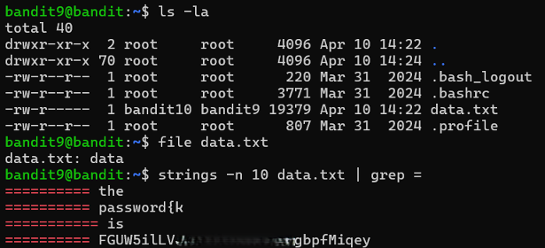

# Bandit Level 9 → Level 10

## Level Goal / Objective

The password for the next level is stored in the file `data.txt` in one of the few human-readable strings, preceded by several `=` characters.

🔗 https://overthewire.org/wargames/bandit/bandit10.html

## Commands You May Need

```text
ls , cd , cat , file , du , find , strings , grep
```

## Concept Focus

* Extracting readable strings from binary files
* Filtering output with `grep`
* Working with non-text files

## Approach

### 1. Connect to the Level

```bash
ssh bandit9@bandit.labs.overthewire.org -p 2220
```

Authenticated using the password obtained from the previous level.

---

### 2. Enumerate the Environment

```bash
ls -la
```

The directory contains:

```text
data.txt
```

---

### 3. Identify the Target

Check file type:

```bash
file data.txt
```

The file is not plain text, so extract readable strings:

```bash
strings -n 10 data.txt | grep =
```

This filters for strings of length ≥10 containing `=`.

---

### 4. Extract the Password

From the filtered output, identify the string that represents the password.

---

## Walkthrough (Screenshots)



---

## Password for Level 10

```text
FGUW5ilL...pfMiqey
```

---

## Key Takeaways

* `strings` is useful for extracting readable data from binary files
* Combining with `grep` allows precise filtering
* Not all files labeled as "data" are human-readable
