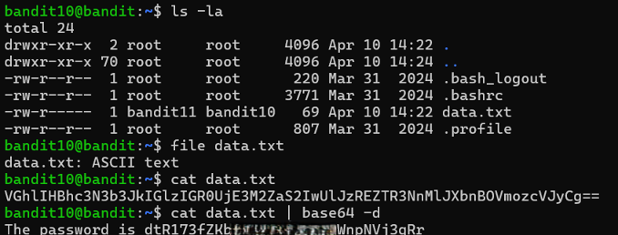

# Bandit Level 10 → Level 11

## Level Goal / Objective

The password for the next level is stored in the file `data.txt`, which contains base64 encoded data.

🔗 https://overthewire.org/wargames/bandit/bandit11.html

## Commands You May Need

```text
ls , cd , cat , file , du , find , base64
```

## Concept Focus

* Decoding base64 data
* Identifying encoded content
* Using command-line decoding tools

## Approach

### 1. Connect to the Level

```bash
ssh bandit10@bandit.labs.overthewire.org -p 2220
```

Authenticated using the password obtained from the previous level.

---

### 2. Enumerate the Environment

```bash
ls -la
```

The directory contains:

```text
data.txt
```

---

### 3. Identify the Target

Check file type:

```bash
file data.txt
```

The file is ASCII text but appears encoded.

---

### 4. Extract the Password

Decode the base64 content:

```bash
cat data.txt | base64 -d
```

This reveals the password for the next level.

---

## Walkthrough (Screenshots)



---

## Password for Level 11

```text
dtR173fZ...Vj3qRr
```

---

## Key Takeaways

* Base64 is a common encoding scheme in CTFs
* `base64 -d` decodes encoded content
* Always inspect file contents for encoding patterns
