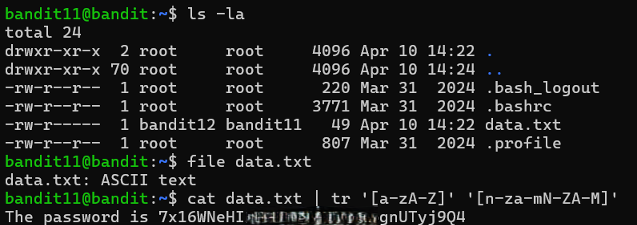

# Bandit Level 11 → Level 12

## Level Goal / Objective

The password for the next level is stored in the file `data.txt`, where all lowercase (a-z) and uppercase (A-Z) letters have been rotated by 13 positions (ROT13).

🔗 https://overthewire.org/wargames/bandit/bandit12.html

## Commands You May Need

```text
ls , cd , cat , file , du , find , tr
```

## Concept Focus

* Understanding ROT13 encoding
* Using `tr` for character substitution
* Basic text transformation

## Approach

### 1. Connect to the Level

```bash
ssh bandit11@bandit.labs.overthewire.org -p 2220
```

Authenticated using the password obtained from the previous level.

---

### 2. Enumerate the Environment

```bash
ls -la
```

The directory contains:

```text
data.txt
```

---

### 3. Identify the Target

Check file type:

```bash
file data.txt
```

The file is readable text but appears encoded using ROT13.

---

### 4. Extract the Password

Decode using `tr`:

```bash
cat data.txt | tr 'a-zA-Z' 'n-za-mN-ZA-M'
```

This translates each character 13 positions, revealing the password.

---

## Walkthrough (Screenshots)



---

## Password for Level 12

```text
7x16WNeH...UTyj9Q4
```

---

## Key Takeaways

* ROT13 is a simple substitution cipher
* `tr` can be used for character translation
* Recognizing encoding patterns is essential in CTFs
