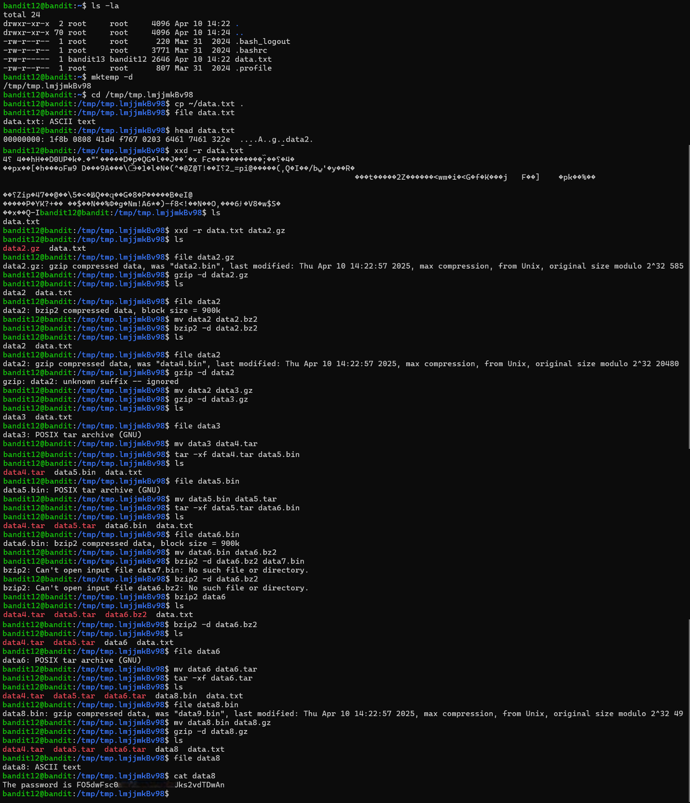

# Bandit Level 12 → Level 13

## Level Goal / Objective

The password for the next level is stored in the file `data.txt`, which is a hexdump of a file that has been repeatedly compressed.

🔗 https://overthewire.org/wargames/bandit/bandit13.html

## Commands You May Need

```text
ls , cd , cat , file , du , find , xxd , gzip , bzip2 , tar
```

## Concept Focus

* Working with hexdumps
* Identifying file types through multiple layers
* Handling various compression formats

## Approach

### 1. Connect to the Level

```bash
ssh bandit12@bandit.labs.overthewire.org -p 2220
```

Authenticated using the password obtained from the previous level.

---

### 2. Prepare Working Directory

```bash
mktemp -d
cd /tmp/<temp_dir>
cp ~/data.txt .
```

---

### 3. Identify the Target

Inspect file:

```bash
file data.txt
```

Convert from hexdump:

```bash
xxd -r data.txt > data
```

---

### 4. Extract the Password

Repeatedly identify and decompress:

- `gzip -d`
- `bzip2 -d`
- `tar -xf`

Continue until a readable file is produced, then:

```bash
cat <final_file>
```

---

## Walkthrough (Screenshots)



---

## Password for Level 13

```text
FO5dwFsc...vdTDwAn
```

---

## Key Takeaways

* Use `xxd -r` to reverse hexdumps
* Always check file type before processing
* Multiple compression layers require iterative extraction
