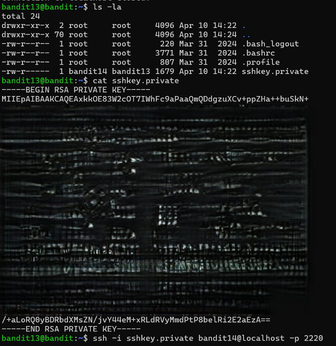

# Bandit Level 13 → Level 14

## Level Goal / Objective

The password for the next level is stored in the file `sshkey.private` and must be used to log into the next level via SSH.

🔗 https://overthewire.org/wargames/bandit/bandit14.html

## Commands You May Need

```text
ls , cd , cat , file , du , find , ssh
```

## Concept Focus

* Using SSH private keys for authentication
* Understanding key-based login
* Secure access methods

## Approach

### 1. Connect to the Level

```bash
ssh bandit13@bandit.labs.overthewire.org -p 2220
```

Authenticated using the password obtained from the previous level.

---

### 2. Enumerate the Environment

```bash
ls -la
```

The directory contains:

```text
sshkey.private
```

---

### 3. Identify the Target

Inspect the file:

```bash
cat sshkey.private
```

This reveals an RSA private key.

---

### 4. Extract the Password

Use the private key to authenticate to the next level:

```bash
ssh -i sshkey.private bandit14@localhost -p 2220
```

This grants access to the next level where the password can be retrieved.

---

## Walkthrough (Screenshots)



---

## Password for Level 14

```text
[Retrieved after SSH login using private key]
```

---

## Key Takeaways

* SSH supports key-based authentication
* Private keys must be handled securely
* Authentication methods can change between levels
