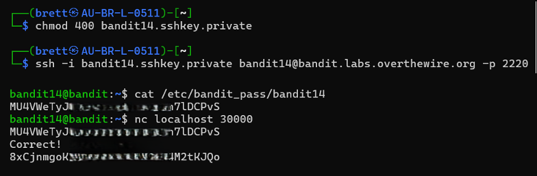

# Bandit Level 14 → Level 15

## Level Goal / Objective

The password for the next level can be retrieved by submitting the password of the current level to port 30000 on localhost.

🔗 https://overthewire.org/wargames/bandit/bandit15.html

## Commands You May Need

```text
ssh , nc , cat
```

## Concept Focus

* Using netcat (`nc`) for network communication
* Interacting with local services
* Sending input to a listening port

## Approach

### 1. Connect to the Level

```bash
ssh -i bandit14.sshkey.private bandit14@bandit.labs.overthewire.org -p 2220
```

Authenticated using the private key from the previous level.

---

### 2. Identify the Target

The instructions indicate a service is listening on port 30000 on localhost.

---

### 3. Extract the Password

Send the current password to the service:

```bash
cat /etc/bandit_pass/bandit14 | nc localhost 30000
```

This returns the password for the next level.

---

## Walkthrough (Screenshots)



---

## Password for Level 15

```text
8xCjnmgo...M2tKJQo
```

---

## Key Takeaways

* `nc` (netcat) is useful for interacting with network services
* Localhost services can expose challenge logic
* Piping input into network connections is a common CTF technique
