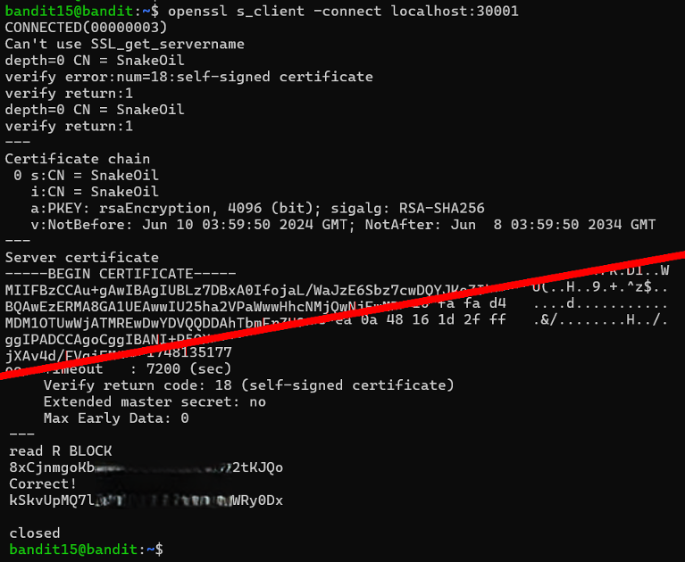

# Bandit Level 15 → Level 16

## Level Goal / Objective

The password for the next level can be retrieved by submitting the current level password to port 30001 on localhost using SSL/TLS encryption.

🔗 https://overthewire.org/wargames/bandit/bandit16.html

## Commands You May Need

```text
ssh , openssl
```

## Concept Focus

* Using SSL/TLS connections
* Interacting with encrypted services
* Handling self-signed certificates

## Approach

### 1. Connect to the Level

```bash
ssh bandit15@bandit.labs.overthewire.org -p 2220
```

Authenticated using the password obtained from the previous level.

---

### 2. Identify the Target

The challenge requires connecting to a service running on port 30001 using SSL.

---

### 3. Extract the Password

Use `openssl s_client` to establish a secure connection:

```bash
openssl s_client -connect localhost:30001
```

Once connected, paste the current password and press enter.

The service returns the password for the next level.

---

## Walkthrough (Screenshots)



---

## Password for Level 16

```text
kSkvUpMQ...WRy0Dx
```

---

## Key Takeaways

* `openssl s_client` allows interaction with SSL/TLS services
* Self-signed certificate warnings can be ignored in controlled environments
* Some services require encrypted communication rather than plain text
