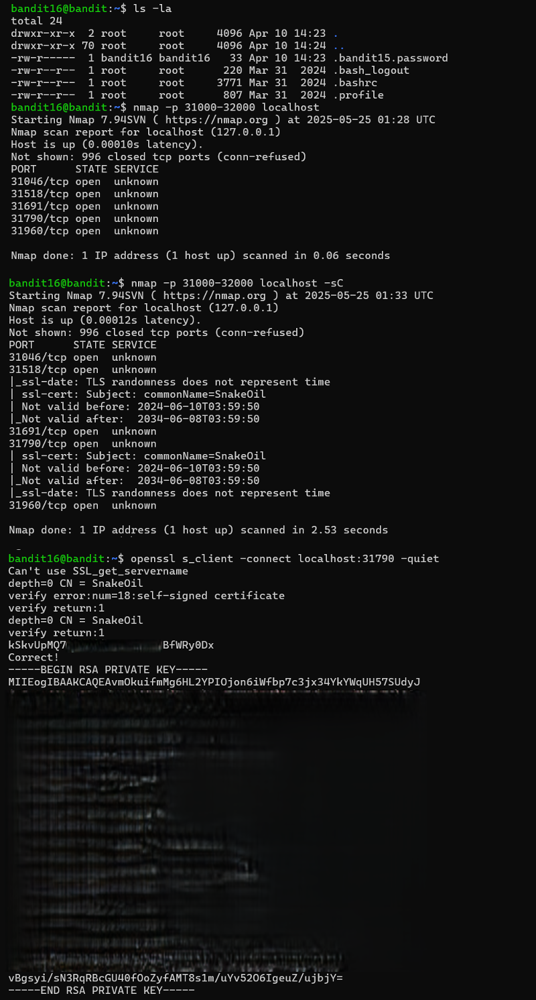

# Bandit Level 16 → Level 17

## Level Goal / Objective

The credentials for the next level can be retrieved by connecting to one of the open ports between 31000 and 32000 on localhost. Only one of these ports speaks SSL and returns the correct data.

🔗 https://overthewire.org/wargames/bandit/bandit17.html

## Commands You May Need

```text
ssh , nmap , openssl
```

## Concept Focus

* Port scanning with `nmap`
* Identifying SSL-enabled services
* Combining reconnaissance with exploitation

## Approach

### 1. Connect to the Level

```bash
ssh bandit16@bandit.labs.overthewire.org -p 2220
```

Authenticated using the password obtained from the previous level.

---

### 2. Identify the Target

Scan for open ports:

```bash
nmap -p 31000-32000 localhost
```

Then perform a service scan:

```bash
nmap -p 31000-32000 localhost -sC
```

This reveals which ports support SSL.

---

### 3. Extract the Password

Connect to the correct SSL port:

```bash
openssl s_client -connect localhost:<port> -quiet
```

Submit the current password when prompted.

This returns an RSA private key for the next level.

---

## Walkthrough (Screenshots)



---

## Password for Level 17

```text
[SSH private key retrieved]
```

---

## Key Takeaways

* `nmap` is essential for discovering services
* Combining scanning with service inspection narrows targets
* SSL services require appropriate tools like `openssl`
