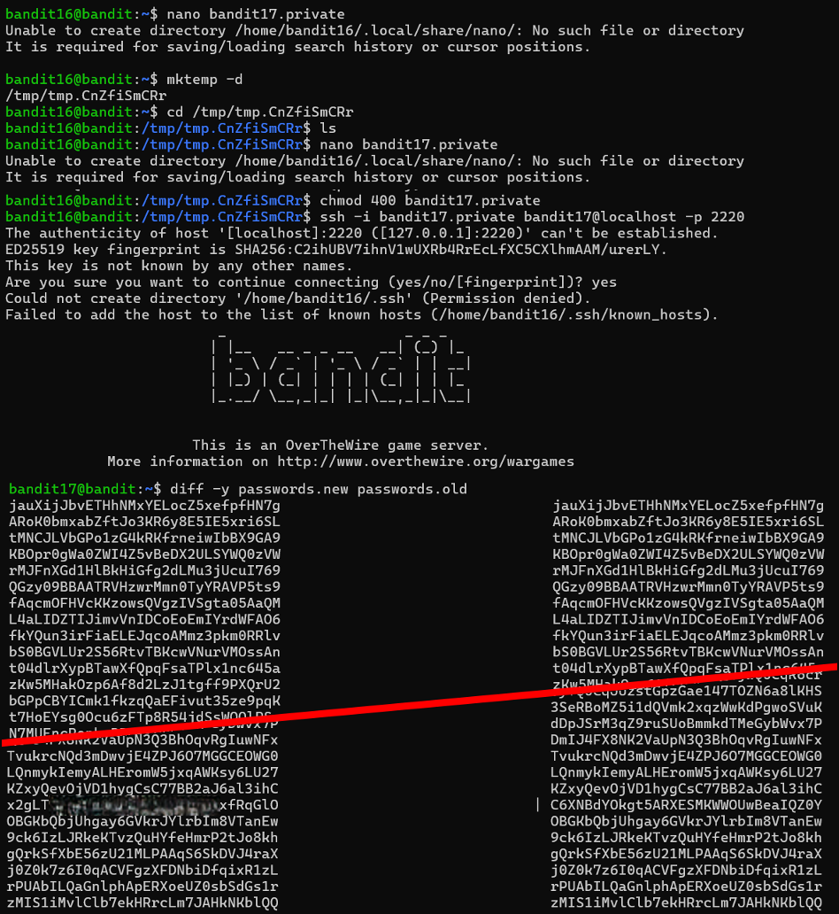

# Bandit Level 17 → Level 18

## Level Goal / Objective

There are 2 files in the home directory: `passwords.old` and `passwords.new`. The password for the next level is in `passwords.new` and is the only line that has been changed between the two files.

🔗 https://overthewire.org/wargames/bandit/bandit18.html

## Commands You May Need

```text
ls , cd , cat , file , du , find , diff
```

## Concept Focus

* Comparing files
* Identifying differences between datasets
* Using `diff` effectively

## Approach

### 1. Connect to the Level

```bash
ssh -i bandit17.private bandit17@bandit.labs.overthewire.org -p 2220
```

Authenticated using the private key obtained from the previous level.

---

### 2. Enumerate the Environment

```bash
ls -la
```

The directory contains:

```text
passwords.old
passwords.new
```

---

### 3. Identify the Target

Compare the two files:

```bash
diff passwords.new passwords.old
```

This highlights the line that differs between the two files.

---

### 4. Extract the Password

The unique line present only in `passwords.new` is the password for the next level.

---

## Walkthrough (Screenshots)



---

## Password for Level 18

```text
x2gLTTjF...KxfRqGlO
```

---

## Key Takeaways

* `diff` is useful for identifying changes between files
* Comparing datasets is a common technique in CTF challenges
* Focus on anomalies when analyzing differences
