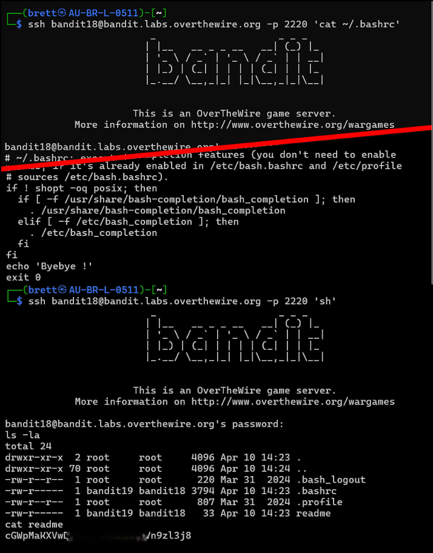

# Bandit Level 18 → Level 19

## Level Goal / Objective

The password for the next level is stored in the file `readme` in the home directory. However, login shells are configured to immediately log out.

🔗 https://overthewire.org/wargames/bandit/bandit19.html

## Commands You May Need

```text
ssh , cat , sh
```

## Concept Focus

* Bypassing restricted shell behavior
* Understanding shell initialization files
* Executing commands directly over SSH

## Approach

### 1. Connect to the Level

A normal SSH login immediately exits due to a command in `.bashrc`.

---

### 2. Identify the Target

The `.bashrc` file contains an `exit` command that terminates the session upon login.

---

### 3. Extract the Password

Bypass the login shell by executing a command directly:

```bash
ssh bandit18@bandit.labs.overthewire.org -p 2220 sh
```

Once connected, list files and read the password:

```bash
ls -la
cat readme
```

---

## Walkthrough (Screenshots)



---

## Password for Level 19

```text
cGWpMaKX...Vn9zl3j8
```

---

## Key Takeaways

* Shell startup files can alter login behavior
* You can bypass restrictions by invoking a different shell
* SSH allows command execution without full interactive login
