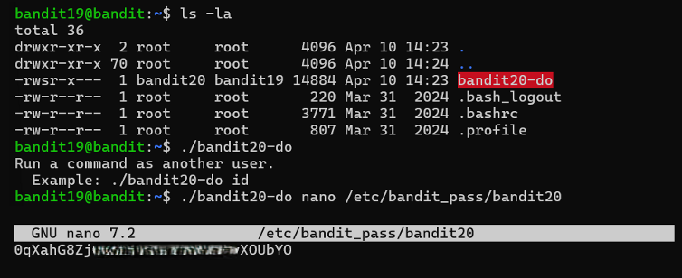

# Bandit Level 19 → Level 20

## Level Goal / Objective

To gain access to the next level, you should use the setuid binary in the home directory.

🔗 https://overthewire.org/wargames/bandit/bandit19.html


## Concept Focus

* Understanding setuid binaries
* Privilege escalation
* Executing commands as another user

## Approach

### 1. Connect to the Level

Log in via SSH using the credentials from the previous level.

---

### 2. Identify the Target

List the files in the home directory and observe a binary named:

```bash
bandit20-do
```

---

### 3. Analyze the Binary

Running the binary without arguments reveals it executes commands as another user.

---

### 4. Extract the Password

Use the binary to execute `cat` on the next level’s password file:

```bash
./bandit20-do cat /etc/bandit_pass/bandit20
```

---

## Walkthrough (Screenshots)



---

## Password for Level 20

```text
0qXahG8Z...XOUbYO
```

---

## Key Takeaways

* Setuid binaries can be leveraged for privilege escalation
* Always inspect unusual executables in a directory
* Combining known file paths with elevated execution is a common exploitation pattern
