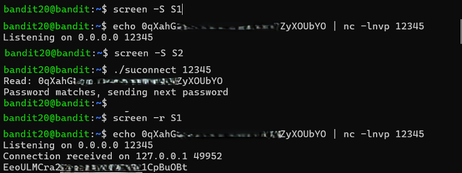

# Bandit Level 20 → Level 21

## Level Goal / Objective

There is a setuid binary in the home directory that does the following: it makes a connection to localhost on the port you specify as a command line argument. It then reads a line of text from the connection and compares it to the password in the previous level. If the password is correct, it will transmit the password for the next level.

🔗 https://overthewire.org/wargames/bandit/bandit20.html

## Commands You May Need

```text
ssh, nc, cat, bash, screen, tmux, Unix ‘job control’ (bg, fg, jobs, &, CTRL-Z, …)
```

## Concept Focus

* Localhost networking
* Client-server interaction
* Using netcat for listeners
* Leveraging setuid binaries

## Approach

### 1. Connect to the Level

Log in via SSH using the credentials from the previous level.

---

### 2. Identify the Target

List files and locate the binary:

```bash
./suconnect
```

This binary connects to a localhost port and validates input.

---

### 3. Set Up a Listener

Start a netcat listener that sends the current level password when a connection is made:

```bash
echo <current_password> | nc -lnvp 12345
```

---

### 4. Trigger the Binary

In another session, execute:

```bash
./suconnect 12345
```

This connects to the listener, verifies the password, and returns the next level’s password.

---

## Walkthrough (Screenshots)



---

## Password for Level 21

```text
EeoULMCr...CpBuOBt
```

---

## Key Takeaways

* Services on localhost can be leveraged for privilege escalation
* Netcat is a powerful tool for quick client-server setups
* Understanding how binaries interact with network services is critical in CTF-style challenges
