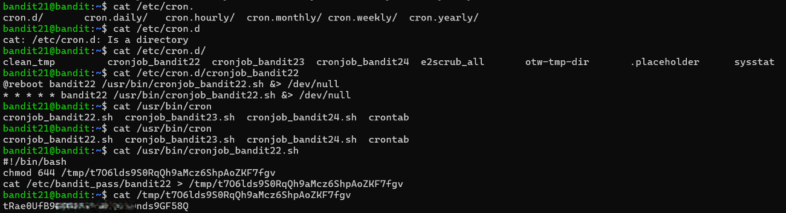

# Bandit Level 21 → Level 22

## Level Goal / Objective

A program is running automatically at regular intervals from cron, the time-based job scheduler. Look in /etc/cron.d/ for the configuration and see what command is being executed.

🔗 https://overthewire.org/wargames/bandit/bandit21.html

## Commands You May Need

```text
cron , crontab , crontab -l , ls , cat
```

## Concept Focus

* Understanding cron jobs
* Inspecting scheduled scripts
* File permissions and automated tasks

## Approach

### 1. Connect to the Level

Log in via SSH using the credentials from the previous level.

---

### 2. Identify the Cron Job

Check the cron directory:

```bash
ls /etc/cron.d/
```

Locate and inspect the relevant job:

```bash
cat /etc/cron.d/cronjob_bandit22
```

---

### 3. Analyze the Script

The cron job runs a script located at:

```bash
cat /usr/bin/cronjob_bandit22.sh
```

The script copies the password for the next level into a file in `/tmp` and sets readable permissions.

---

### 4. Retrieve the Password

Read the file created in `/tmp`:

```bash
cat /tmp/<generated_filename>
```

---

## Walkthrough (Screenshots)



---

## Password for Level 22

```text
tRae0UfB...nds9GF58Q
```

---

## Key Takeaways

* Cron jobs can expose sensitive data if not secured properly
* Always inspect automated scripts for unintended data exposure
* Temporary directories are common locations for exploitable artifacts
