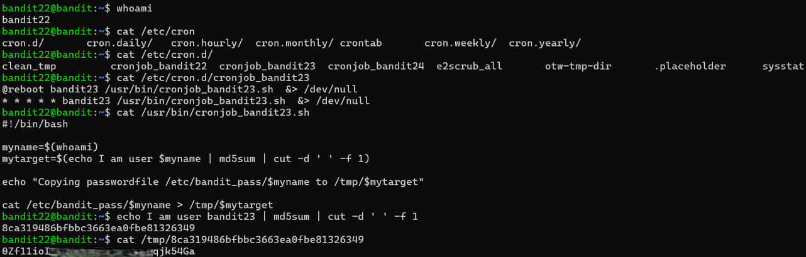

# Bandit Level 22 → Level 23

## Level Goal / Objective

A program is running automatically at regular intervals from cron, the time-based job scheduler. Look in /etc/cron.d/ for the configuration and see what command is being executed.

🔗 https://overthewire.org/wargames/bandit/bandit22.html

## Commands You May Need

```text
cron , crontab , crontab -l , ls , cat , grep , md5sum , cut
```

## Concept Focus

* Scheduled tasks (cron jobs)
* Understanding automated scripts
* Hashing with md5
* File discovery in /tmp

## Approach

### 1. Connect to the Level

Log in via SSH using the credentials from the previous level.

---

### 2. Identify the Cron Job

Check the cron directory:

```bash
ls /etc/cron.d/
```

Locate the relevant job and inspect it:

```bash
cat /etc/cron.d/cronjob_bandit23
```

---

### 3. Analyze the Script

The cron job runs a script located at:

```bash
cat /usr/bin/cronjob_bandit23.sh
```

The script:
- Gets the current username
- Generates an md5 hash based on that username
- Copies the password file to `/tmp/<hashed_value>`

---

### 4. Recreate the Hash

Replicate the hash locally:

```bash
echo I am user bandit23 | md5sum | cut -d ' ' -f 1
```

---

### 5. Retrieve the Password

Use the generated hash to locate the file in `/tmp`:

```bash
cat /tmp/<hashed_value>
```

---

## Walkthrough (Screenshots)



---

## Password for Level 23

```text
0Zf11ioI...qjk54Ga
```

---

## Key Takeaways

* Cron jobs can expose sensitive operations
* Reading system scripts reveals hidden logic
* Hashing mechanisms can be reversed when inputs are known
* Temporary directories often store exploitable data
