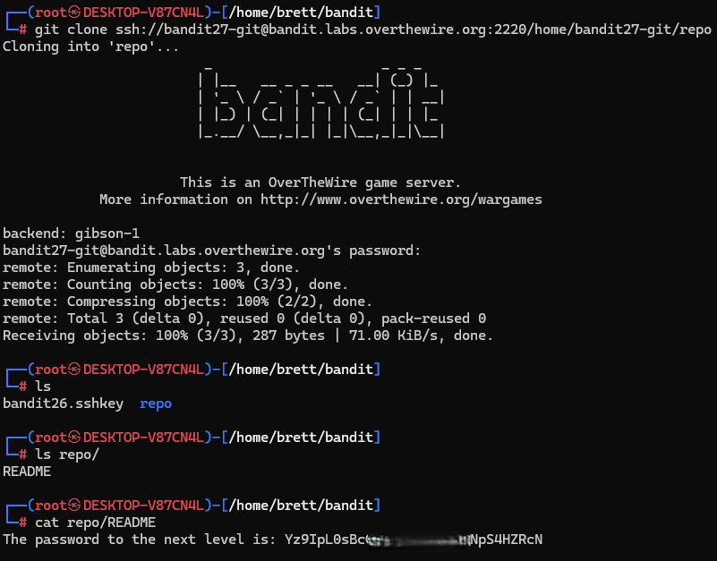

# Bandit Level 27 → Level 28

## Level Goal / Objective

There is a git repository at ssh://bandit27-git@localhost/home/bandit27-git/repo. The password for the user bandit27-git is the same as for the user bandit27.

🔗 https://overthewire.org/wargames/bandit/bandit27.html

## Commands You May Need

```text
git , clone , ls , cat
```

## Concept Focus

* Interacting with remote Git repositories
* Cloning repositories over SSH
* Inspecting repository contents
* Basic Git usage in CTF scenarios

## Approach

### 1. Connect to the Level

Log in via SSH using the credentials from the previous level.

---

### 2. Clone the Repository

Use git to clone the remote repository:

```bash
git clone ssh://bandit27-git@bandit.labs.overthewire.org:2220/home/bandit27-git/repo
```

---

### 3. Inspect the Repository

Navigate into the cloned directory and list its contents:

```bash
cd repo
ls
```

---

### 4. Retrieve the Password

Read the README file:

```bash
cat README
```

The file contains the password for the next level.

---

## Walkthrough (Screenshots)



---

## Password for Level 28

```text
Yz9IpL0s...4HZRcN
```

---

## Key Takeaways

* Git repositories may contain sensitive information in plain text
* Always inspect repository contents after cloning
* SSH-based Git access uses the same credentials as system users
* Simple enumeration often reveals the solution in early Git-based challenges
