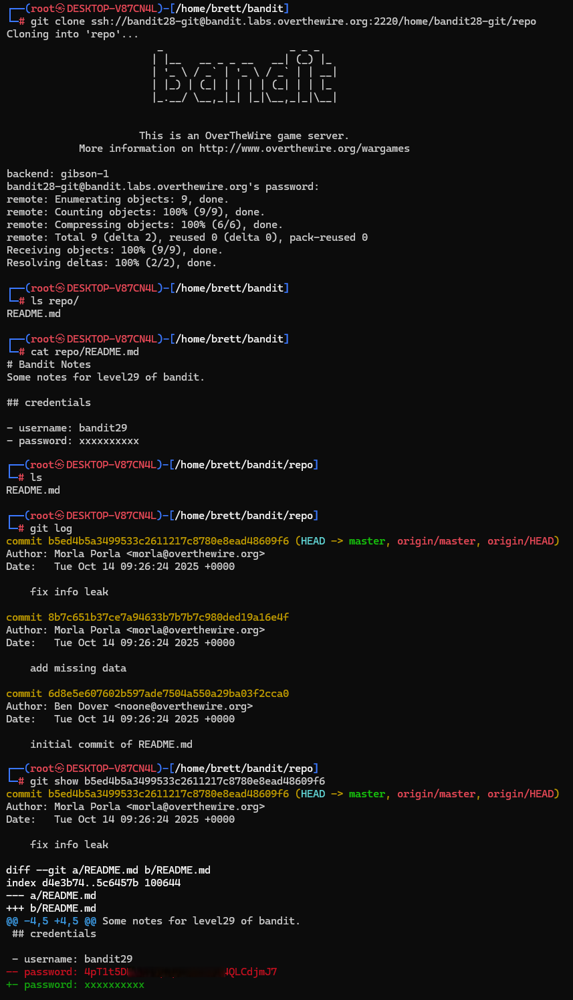

# Bandit Level 28 → Level 29

## Level Goal / Objective

There is a git repository at ssh://bandit28-git@localhost/home/bandit28-git/repo. The password for the user bandit28-git is the same as for the user bandit28.

🔗 https://overthewire.org/wargames/bandit/bandit28.html

## Commands You May Need

```text
git , grep , ls , cat
```

## Concept Focus

* Inspecting Git commit history
* Recovering deleted data from version control
* Using `git log` and `git show`
* Investigating repository changes over time

## Approach

### 1. Connect to the Level

Log in via SSH using the credentials from the previous level.

---

### 2. Clone the Repository

Clone the remote Git repository:

```bash
git clone ssh://bandit28-git@bandit.labs.overthewire.org:2220/home/bandit28-git/repo
```

---

### 3. Inspect the Repository

Check the contents of the repository and read the README file:

```bash
cd repo
ls
cat README.md
```

The file only shows placeholder credentials, so the next step is to inspect the commit history.

---

### 4. Review the Git History

List the repository commits:

```bash
git log
```

This shows that the README was modified multiple times.

---

### 5. Recover the Removed Password

Inspect the commit diff to see what was changed:

```bash
git show <commit_hash>
```

By reviewing the earlier version of the README, the removed password is revealed in the diff output.

---

## Walkthrough (Screenshots)



---

## Password for Level 29

```text
4pT1t5DE...LCdjmJ7
```

---

## Key Takeaways

* Git history often contains sensitive data even after it is removed from the latest version
* `git log` helps identify where interesting changes happened
* `git show` is useful for recovering deleted or modified content
* Version control metadata can be just as important as the current files
