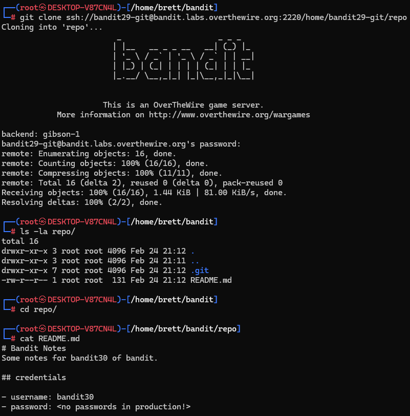
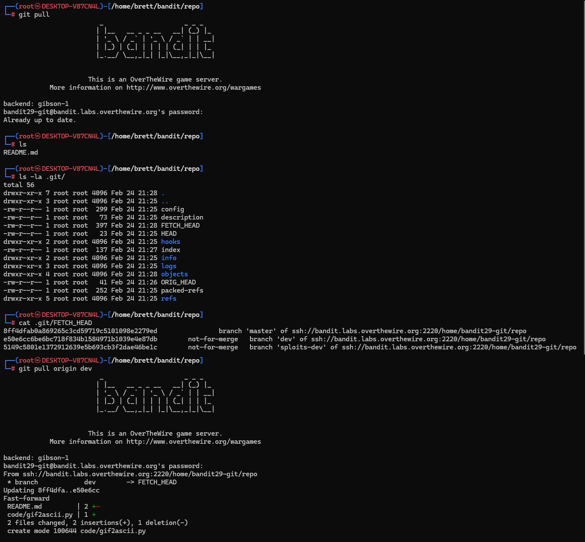
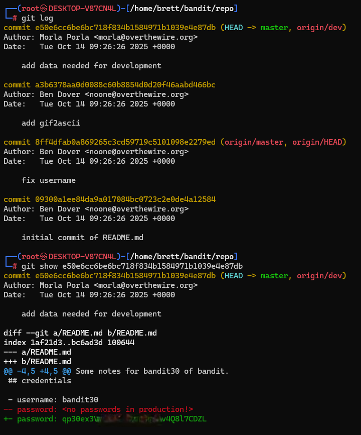

# Bandit Level 29 → Level 30

## Level Goal / Objective

There is a git repository at ssh://bandit29-git@localhost/home/bandit29-git/repo. The password for the user bandit29-git is the same as for the user bandit29.

🔗 https://overthewire.org/wargames/bandit/bandit29.html

## Commands You May Need

```text
git
```

## Concept Focus

* Enumerating Git branches
* Investigating remote references
* Inspecting alternate development branches
* Recovering secrets from branch history

## Approach

### 1. Connect to the Level

Log in via SSH using the credentials from the previous level.

---

### 2. Clone the Repository

Clone the remote Git repository:

```bash
git clone ssh://bandit29-git@bandit.labs.overthewire.org:2220/home/bandit29-git/repo
```

---

### 3. Inspect the Repository

Check the repository contents and read the README:

```bash
cd repo
ls -la
cat README.md
```

The README only shows a placeholder password, so the next step is to investigate the repository further.

---

### 4. Enumerate Branches

Inspect the Git metadata and look for other branches:

```bash
git branch -a
```

This reveals additional branches, including a `dev` branch.

---

### 5. Investigate the Dev Branch

Pull or check out the `dev` branch and inspect its history:

```bash
git checkout dev
git log
```

The commit history on that branch contains changes not present on `master`.

---

### 6. Recover the Password

Inspect the relevant commit diff:

```bash
git show <commit_hash>
```

Reviewing the diff reveals the real password that replaced the placeholder value.

---

## Walkthrough (Screenshots)







---

## Password for Level 30

```text
qp30ex3V...8l7CDZL
```

---

## Key Takeaways

* Sensitive data may exist on non-default branches
* `git branch -a` is useful for finding hidden or overlooked refs
* Development branches often contain information removed from production branches
* Repository history and structure can both leak credentials
