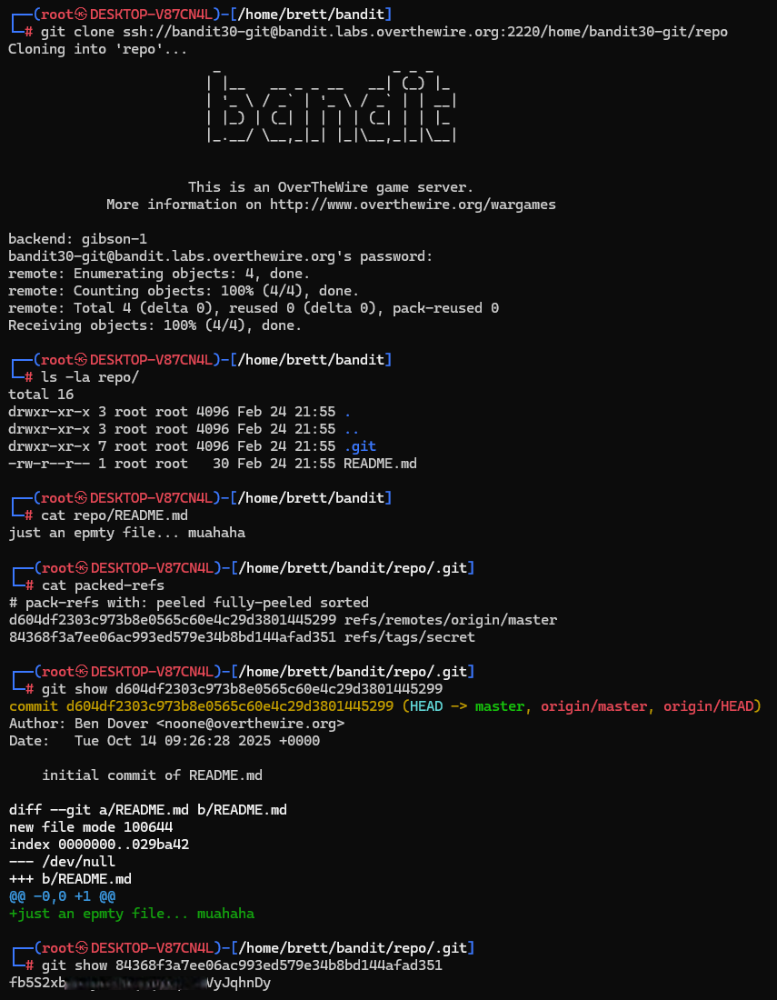

# Bandit Level 30 → Level 31

## Level Goal / Objective

There is a git repository at ssh://bandit30-git@localhost/home/bandit30-git/repo. The password for the user bandit30-git is the same as for the user bandit30.

🔗 https://overthewire.org/wargames/bandit/bandit30.html

## Commands You May Need

```text
git , cat , ls
```

## Concept Focus

* Inspecting Git internals
* Exploring packed references
* Working with tags in Git
* Recovering hidden data from repository metadata

## Approach

### 1. Connect to the Level

Log in via SSH using the credentials from the previous level.

---

### 2. Clone the Repository

Clone the remote repository:

```bash
git clone ssh://bandit30-git@bandit.labs.overthewire.org:2220/home/bandit30-git/repo
```

---

### 3. Inspect the Repository

Check the contents:

```bash
cd repo
ls -la
cat README.md
```

The README does not contain useful information.

---

### 4. Inspect Git Metadata

Look into the `.git` directory for additional references:

```bash
cd .git
cat packed-refs
```

This reveals a reference to a tag named `secret`.

---

### 5. Retrieve the Password

Use the commit hash associated with the tag:

```bash
git show <commit_hash>
```

This reveals the password for the next level.

---

## Walkthrough (Screenshots)



---

## Password for Level 31

```text
fb5S2xb7...VyJqhnDy
```

---

## Key Takeaways

* Git metadata can contain hidden references such as tags
* `packed-refs` can reveal objects not visible in normal workflows
* Tags can point to sensitive data
* Always inspect `.git` internals when nothing obvious is found
