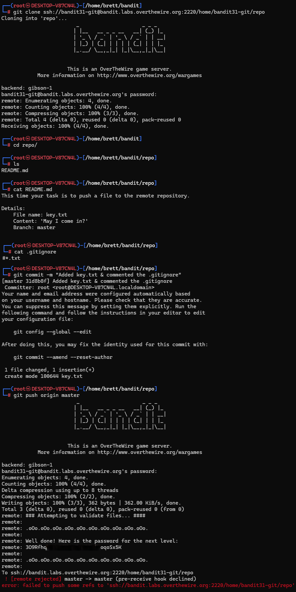

# Bandit Level 31 → Level 32

## Level Goal / Objective

There is a git repository at ssh://bandit31-git@localhost/home/bandit31-git/repo. The password for the user bandit31-git is the same as for the user bandit31.

🔗 https://overthewire.org/wargames/bandit/bandit31.html

## Commands You May Need

```text
git , grep , ls , cat , php
```

## Concept Focus

* Pushing changes to remote Git repositories
* Inspecting repository instructions
* Understanding `.gitignore` behavior
* Working around pre-receive hooks

## Approach

### 1. Connect to the Level

Log in via SSH using the credentials from the previous level.

---

### 2. Clone the Repository

Clone the remote repository:

```bash
git clone ssh://bandit31-git@bandit.labs.overthewire.org:2220/home/bandit31-git/repo
```

---

### 3. Read the Instructions

Inspect the repository contents and read the README:

```bash
cd repo
ls
cat README.md
```

The README explains that a file named `key.txt` must be created on the `master` branch with the content:

```text
May I come in?
```

---

### 4. Handle the `.gitignore`

The initial attempt to add `key.txt` fails because the repository is configured to ignore `*.txt` files.

Inspect and adjust the ignore rule so the file can be committed.

---

### 5. Commit and Push

Create the required file, commit the changes, and push to the remote repository:

```bash
git add key.txt
git commit -m "Add key.txt"
git push origin master
```

Even though the push is rejected by the pre-receive hook, the remote output reveals the password for the next level during validation.

---

## Walkthrough (Screenshots)



---

## Password for Level 32

```text
3O9Rfhqy...oqoSx5K
```

---

## Key Takeaways

* `.gitignore` can prevent expected files from being committed
* Remote Git hooks may validate content before accepting a push
* Important output can appear even when an action ultimately fails
* Always read both local and remote command output carefully
