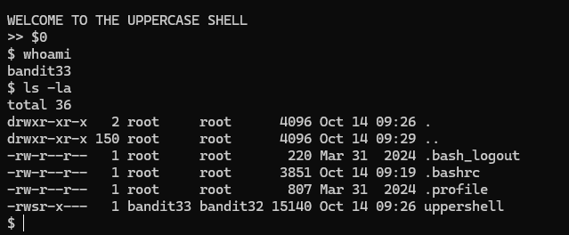

# Bandit Level 32 → Level 33

## Level Goal / Objective

After all this git stuff, it’s time for another escape. Good luck!

🔗 https://overthewire.org/wargames/bandit/bandit32.html

## Commands You May Need

```text
sh , shell
```

## Concept Focus

* Escaping restricted shells
* Understanding how shell wrappers invoke commands
* Using `$0` to spawn a usable shell
* Reading protected password files after shell escape

## Approach

### 1. Connect to the Level

Log in via SSH using the credentials from the previous level.

---

### 2. Identify the Restriction

After login, the session drops into the `UPPERSHELL`, which forces commands to uppercase and makes normal interaction difficult.

---

### 3. Escape the Shell

Investigate how the shell is being invoked and use:

```bash
$0
```

This starts a normal shell instead of remaining trapped in the uppercase wrapper.

---

### 4. Verify Access

Once the shell is escaped, basic commands work normally:

```bash
whoami
ls -la
```

---

### 5. Retrieve the Password

Read the next level’s password file:

```bash
cat /etc/bandit_pass/bandit33
```

---

## Walkthrough (Screenshots)



---

## Password for Level 33

```text
tQdtbs5D...L8izoeJ0
```

---

## Key Takeaways

* Restricted shells can sometimes be escaped by understanding how they launch subshells
* `$0` can reveal or invoke the current shell in useful ways
* Wrapper environments often block common workflows but still expose alternative execution paths
* Once escaped, normal privilege boundaries and file access rules apply
