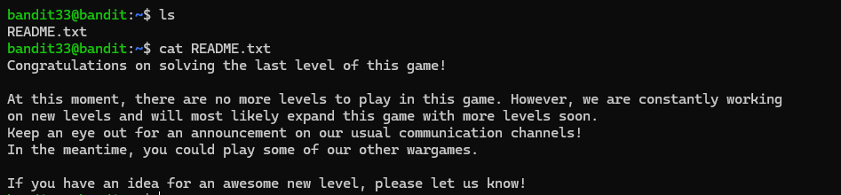

# Bandit Level 33 → End

## Level Goal / Objective

At this moment, there are no more levels to play in this game.

🔗 https://overthewire.org/wargames/bandit/bandit33.html

## Commands You May Need

```text
ls , sh , cat
```

## Concept Focus

* End of challenge validation
* Reading final output
* Verifying completion

## Approach

### 1. Connect to the Level

Log in via SSH using the credentials from the previous level.

---

### 2. Inspect the Directory

List the files in the home directory:

```bash
ls
```

A file named `README.txt` is present.

---

### 3. Read the File

Display the contents:

```bash
cat README.txt
```

The file contains a congratulatory message indicating completion of the Bandit wargame.

---

## Walkthrough (Screenshots)



---

## Completion

```text
Bandit Wargame Completed
```

---

## Key Takeaways

* Not every level involves exploitation—some confirm completion
* Always inspect available files, even at the end
* Completion messages validate successful progression through all levels
