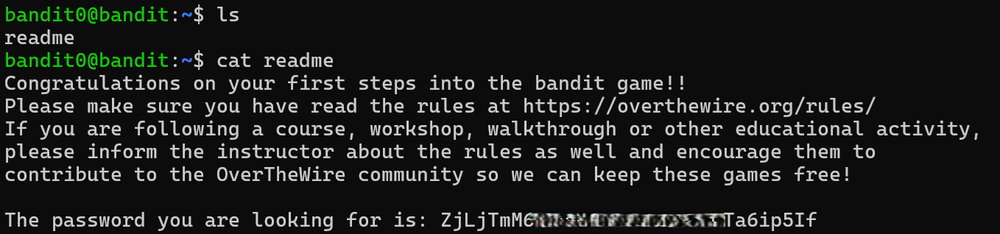

# Bandit Level 0 → Level 1

## Level Goal / Objective

The password for the next level is stored in a file called readme located in the home directory. Use this password to log into bandit1 using SSH. Whenever you find a password for a level, use SSH (on port 2220) to log into that level and continue the game.

🔗 https://overthewire.org/wargames/bandit/bandit0.html

## Commands You May Need

```
ls , cd , cat , file , du , find
```

## Concept Focus

* Basic Linux file listing
* Reading file contents

## Approach

### 1. Connect to the Level

```bash
ssh bandit0@bandit.labs.overthewire.org -p 2220
```

Authenticated using the provided credentials:

```
Username: bandit0
Password: bandit0
```

---

### 2. Enumerate the Environment

```bash
ls -la
```

The home directory contains a file named:

```
readme
```

---

### 3. Extract the Password

```bash
cat readme
```

The file contains introductory text and the password for the next level.

---

## Walkthrough (Screenshots)

### Initial Enumeration and File Access



The `ls` command reveals the `readme` file. Using `cat` displays its contents, which includes the password.

---

## Password for Level 1

```text
ZjLjTmM6...Ta6ip5If
```

---

## Key Takeaways

* SSH is the primary method of accessing Bandit levels
* Always begin with basic enumeration (`ls`)
* Plain text files often contain credentials in early levels
