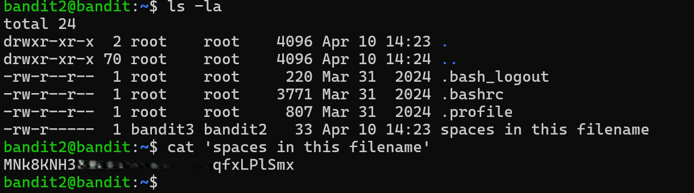

# Bandit Level 2 → Level 3

## Level Goal / Objective

The password for the next level is stored in a file called `spaces in this filename` located in the home directory.

🔗 https://overthewire.org/wargames/bandit/bandit3.html

## Commands You May Need

```text
ls , cd , cat , file , du , find
```

## Concept Focus

* Handling filenames with spaces
* Proper use of quoting in the shell

## Approach

### 1. Connect to the Level

```bash
ssh bandit2@bandit.labs.overthewire.org -p 2220
```

Authenticated using the password obtained from the previous level.

---

### 2. Enumerate the Environment

```bash
ls -la
```

The directory listing reveals a file named:

```text
spaces in this filename
```

Filenames with spaces must be handled carefully in the shell.

---

### 3. Identify the Target

Attempting to read the file without quotes:

```bash
cat spaces in this filename
```

This fails because the shell interprets each word as a separate argument.

---

### 4. Extract the Password

Use quotes to treat the filename as a single argument:

```bash
cat 'spaces in this filename'
```

This allows the file to be read correctly.

---

## Walkthrough (Screenshots)

### Step 1 – Enumerating Files



The `ls -la` command reveals a file with spaces in its name.

---

### Step 2 – Reading the File


Using quotes allows `cat` to correctly interpret the full filename and display its contents.

---

## Password for Level 3

```text
MNk8KNH3...LPlSmx
```

---

## Key Takeaways

* Spaces in filenames must be handled with quotes or escaping
* The shell splits arguments on whitespace by default
* Quoting ensures the filename is treated as a single argument
