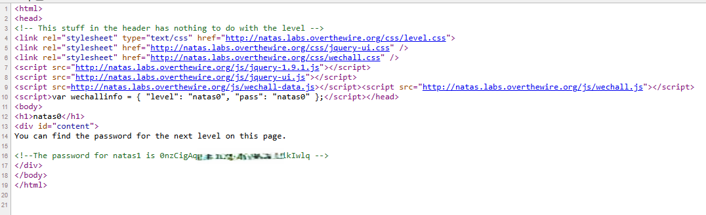

# Natas Level 0 → Level 1

## Level Goal / Objective

Log in to the Natas level and find the password for the next level.

🔗 https://overthewire.org/wargames/natas/natas0.html

## Tools You May Need

```
Browser DevTools, view-source
```

## Concept Focus

* Viewing page source
* Client-side information disclosure

## Approach

### 1. Access the Level

Navigate to:

```
http://natas0.natas.labs.overthewire.org
```

Authenticate using:

```
Username: natas0
Password: natas0
```

---

### 2. Initial Enumeration

The page displays a simple message indicating that the password is not visible directly.

No interactive elements or input fields are present.

---

### 3. Investigate Further

Viewing the page source reveals hidden information within HTML comments.

---

### 4. Extract the Password

The password for the next level is stored inside an HTML comment in the source code.

---

## Walkthrough (Screenshots)



---

## Password for Level 1

```text
0nzCigAq... (redacted)
```

---

## Key Takeaways

* Sensitive data should never be stored in client-side source code
* Always inspect HTML comments during enumeration
* Initial enumeration should include viewing page source
