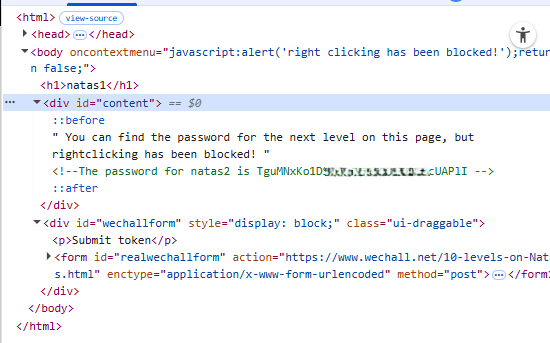

# Natas Level 1 → Level 2

## Level Goal / Objective

Find the password for the next level.

🔗 https://overthewire.org/wargames/natas/natas1.html

## Tools You May Need

```
Browser DevTools, view-source
```

## Concept Focus

* Bypassing client-side restrictions
* Viewing page source despite disabled UI controls

## Approach

### 1. Access the Level

Navigate to:

```
http://natas1.natas.labs.overthewire.org/
```

Authenticate using:

```
Username: natas1
Password: <previous level password>
```

---

### 2. Initial Enumeration

The page appears similar to the previous level, but right-click functionality is disabled.

A message indicates that right-clicking has been blocked.

---

### 3. Investigate Further

Despite the restriction, client-side controls can be bypassed.

Use browser developer tools:

- Press `F12`
- Open the **Elements** tab or view page source

---

### 4. Extract the Password

Within the HTML source, a comment contains the password for the next level.

---

## Walkthrough (Screenshots)



---

## Password for Level 2

```text
TguMNxKo1DSa... (redacted)
```

---

## Key Takeaways

* Client-side restrictions (like disabling right-click) do not provide real security
* Developer tools allow full inspection regardless of UI limitations
* Always inspect source even when basic actions are blocked
