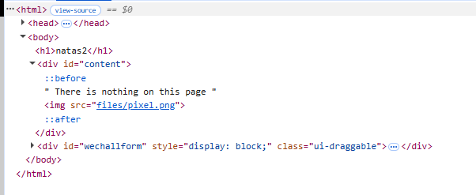
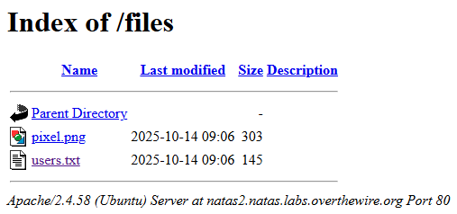

# Natas Level 2 → Level 3

## Level Goal / Objective

Find the password for the next level.

🔗 https://overthewire.org/wargames/natas/natas2.html

## Tools You May Need

```text
Browser DevTools, view-source
```

## Concept Focus

* Source code inspection
* Directory enumeration
* Exposed files in web directories

## Approach

### 1. Access the Level

Navigate to:

```text
http://natas2.natas.labs.overthewire.org
```

Authenticate using:

```text
Username: natas2
Password: <previous level password>
```

---

### 2. Initial Enumeration

Viewing the page source shows an image reference:

```html

```

This suggests there may be a browsable directory at `/files/`.

---

### 3. Investigate Further

Adjust the URL to:

```text
http://natas2.natas.labs.overthewire.org/files/
```

The directory listing is enabled and exposes multiple files, including:

```text
pixel.png
users.txt
```

---

### 4. Extract the Password

Open `users.txt` from the exposed directory listing.

The file contains several username/password pairs, including the credential for the next level.

---

## Walkthrough (Screenshots)




---

## Password for Level 3

```text
3gqisGdR0p... (redacted)
```

---

## Key Takeaways

* Source code can reveal hidden paths and directories
* Directory listing can expose sensitive files if not disabled
* Always inspect referenced files and directories during enumeration
