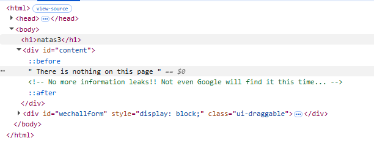
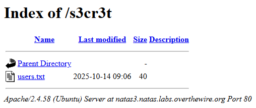
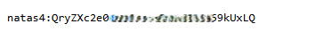

# Natas Level 3 → Level 4

## Level Goal / Objective

Find the password for the next level.

🔗 https://overthewire.org/wargames/natas/natas3.html

## Tools You May Need

```text
Browser DevTools, view-source
```

## Concept Focus

* robots.txt enumeration
* Hidden directories
* Information disclosure via indexing rules

## Approach

### 1. Access the Level

Navigate to:

```text
http://natas3.natas.labs.overthewire.org/
```

Authenticate using:

```text
Username: natas3
Password: <previous level password>
```

---

### 2. Initial Enumeration

Viewing the page source reveals a comment:

```html
<!-- No more information leaks!! Not even Google will find it this time... -->
```

This suggests that search engines are intentionally being restricted.

---

### 3. Investigate Further

Check the `robots.txt` file:

```text
http://natas3.natas.labs.overthewire.org/robots.txt
```

Contents:

```text
User-agent: *
Disallow: /s3cr3t/
```

This reveals a hidden directory.

---

### 4. Discover Hidden Directory

Navigate to:

```text
http://natas3.natas.labs.overthewire.org/s3cr3t/
```

Directory listing is enabled and contains:

```text
users.txt
```

---

### 5. Extract the Password

Open `users.txt` to find the credentials for the next level.

---

## Walkthrough (Screenshots)





---

## Password for Level 4

```text
QryZXc2e0za... (redacted)
```

---

## Key Takeaways

* robots.txt can reveal sensitive or hidden directories
* Disallowed paths are still accessible if directly navigated
* Always check for indexing and enumeration artifacts during recon
