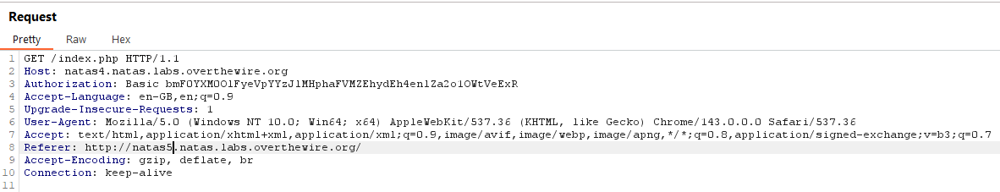
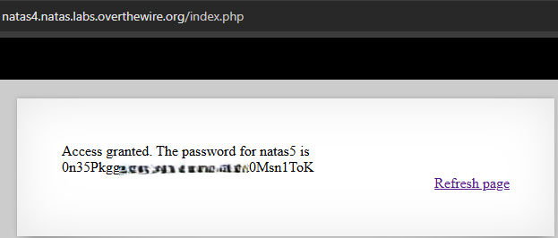

# Natas Level 4 → Level 5

## Level Goal / Objective

Find the password for the next level.

🔗 https://overthewire.org/wargames/natas/natas4.html

## Tools You May Need

```text
Browser DevTools, Burp Suite
```

## Concept Focus

* HTTP headers manipulation
* Referer-based access control
* Intercepting and modifying requests

## Approach

### 1. Access the Level

Navigate to:

```text
http://natas4.natas.labs.overthewire.org/
```

Authenticate using:

```text
Username: natas4
Password: <previous level password>
```

---

### 2. Initial Enumeration

The page indicates that access is denied unless the request originates from a specific location.

This suggests a check on the HTTP `Referer` header.

---

### 3. Investigate Further

Intercept the request using Burp Suite:

- Enable proxy interception
- Refresh the page
- Capture the HTTP request

Modify the `Referer` header to:

```text
Referer: http://natas5.natas.labs.overthewire.org/
```

Forward the modified request.

---

### 4. Extract the Password

The server accepts the modified request and returns the password for the next level.

---

## Walkthrough (Screenshots)





---

## Password for Level 5

```text
0n35PkggAPm2... (redacted)
```

---

## Key Takeaways

* HTTP headers can be manipulated client-side and should not be trusted
* Referer-based access controls are insecure and easily bypassed
* Interception tools like Burp Suite are essential for web security testing
