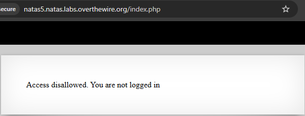
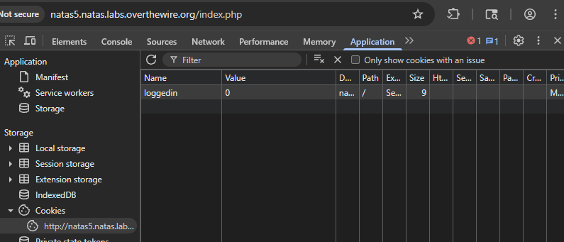
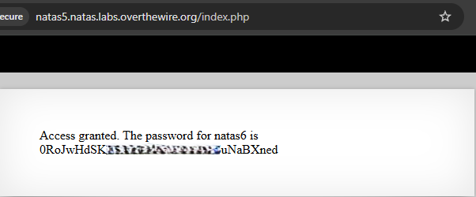

# Natas Level 5 → Level 6

## Level Goal / Objective

Find the password for the next level.

🔗 https://overthewire.org/wargames/natas/natas5.html

## Tools You May Need

```text
Browser DevTools
```

## Concept Focus

* Cookie manipulation
* Client-side authentication controls
* Trusting user-controlled data

## Approach

### 1. Access the Level

Navigate to:

```text
http://natas5.natas.labs.overthewire.org/
```

Authenticate using:

```text
Username: natas5
Password: <previous level password>
```

---

### 2. Initial Enumeration

The page indicates that access is denied and the user is not logged in.

This suggests authentication state is being tracked client-side.

---

### 3. Investigate Further

Open browser developer tools and inspect cookies:

- Navigate to **Application → Cookies**
- Identify the `loggedin` cookie

The value is set to:

```text
loggedin=0
```

Modify the value to:

```text
loggedin=1
```

Refresh the page after making the change.

---

### 4. Extract the Password

After modifying the cookie and refreshing, access is granted and the password for the next level is displayed.

---

## Walkthrough (Screenshots)







---

## Password for Level 6

```text
0RoJwHdSKWFT... (redacted)
```

---

## Key Takeaways

* Authentication should never rely solely on client-side cookies
* Cookies can be modified easily and should not be trusted
* Always inspect and manipulate client-side storage during web enumeration
