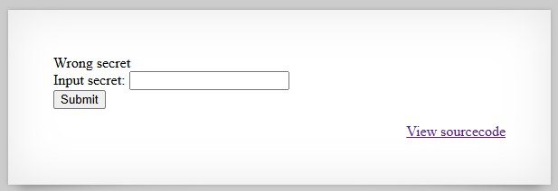
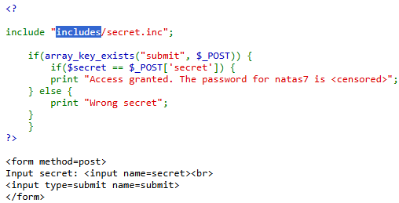
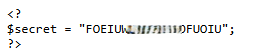
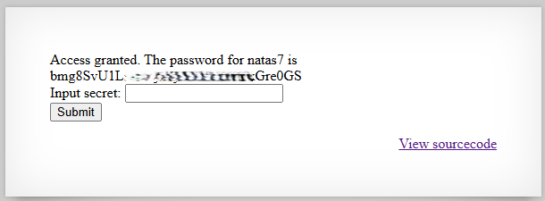

# Natas Level 6 → Level 7

## Level Goal / Objective

Find the password for the next level.

🔗 https://overthewire.org/wargames/natas/natas6.html

## Tools You May Need

```text
Browser DevTools, view-source
```

## Concept Focus

* Source code disclosure
* Exposed backend files
* Insecure file inclusion

## Approach

### 1. Access the Level

Navigate to:

```text
http://natas6.natas.labs.overthewire.org
```

Authenticate using:

```text
Username: natas6
Password: <previous level password>
```

---

### 2. Initial Enumeration

Viewing the source code reveals a PHP include statement:

```php
include "includes/secret.inc";
```

This suggests that the secret value is stored in an external file.

---

### 3. Investigate Further

Navigate directly to the included file:

```text
http://natas6.natas.labs.overthewire.org/includes/secret.inc
```

This reveals the secret value used for validation.

---

### 4. Extract the Password

Submit the discovered secret value in the input field.

The application validates the input and returns the password for the next level.

---

## Walkthrough (Screenshots)









---

## Password for Level 7

```text
bmg8SvU1Lizu... (redacted)
```

---

## Key Takeaways

* Sensitive data should not be stored in accessible backend files
* Source code can reveal hidden application logic and file paths
* Direct access to included files can expose secrets
