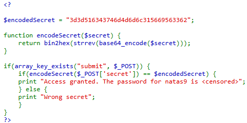
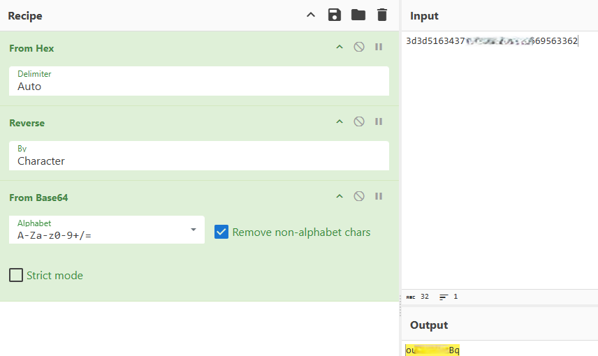

# Natas Level 8 → Level 9

## Level Goal / Objective

Find the password for the next level.

🔗 https://overthewire.org/wargames/natas/natas8.html

## Tools You May Need

```text
Browser DevTools, CyberChef
```

## Concept Focus

* Encoding/decoding logic
* Reversing transformations
* Understanding application logic

## Approach

### 1. Access the Level

Navigate to:

```text
http://natas8.natas.labs.overthewire.org/
```

Authenticate using:

```text
Username: natas8
Password: <previous level password>
```

---

### 2. Initial Enumeration

Viewing the source code reveals an encoded secret and the encoding function:

```php
$encodedSecret = "3d3d516343746d4d6d6c315669563362";

function encodeSecret($secret) {
    return bin2hex(strrev(base64_encode($secret)));
}
```

---

### 3. Reverse the Encoding Logic

To obtain the original secret, reverse the encoding process:

1. Convert hex → raw string
2. Reverse the string (undo `strrev`)
3. Decode using Base64

Using CyberChef:

- From Hex
- Reverse (by character)
- From Base64

Recovered input secret:

```text
oubWY... (Redacted)
```

---

### 4. Extract the Password

Submit the decoded secret in the input field.

The application validates the input and returns the password for the next level.

---

## Walkthrough (Screenshots)




---

## Password for Level 9

```text
ZE1ck82lmdGI... (redacted)
```

---

## Key Takeaways

* Understanding encoding chains is critical for reversing application logic
* Multiple transformations often need to be reversed in correct order
* Tools like CyberChef simplify complex decoding workflows
