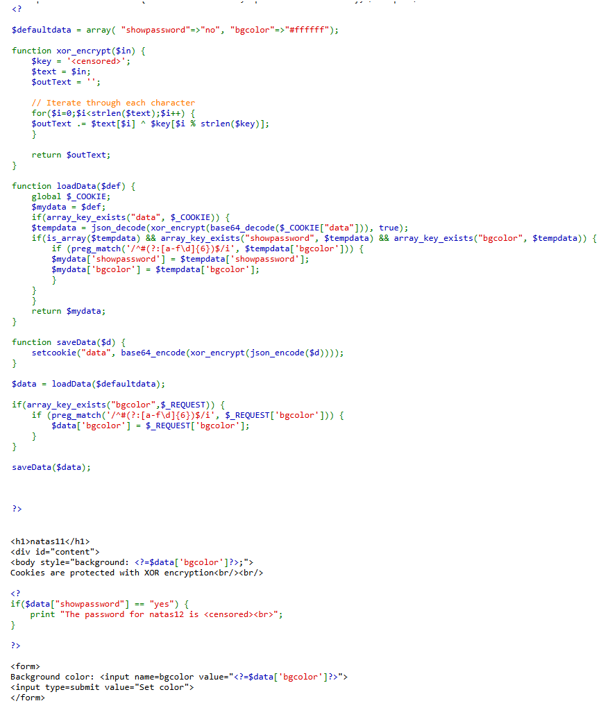
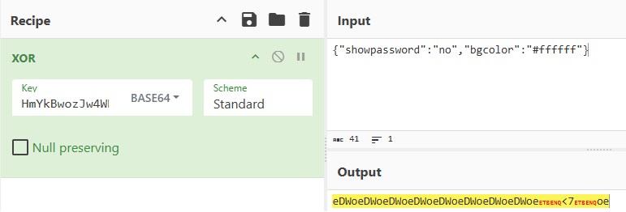
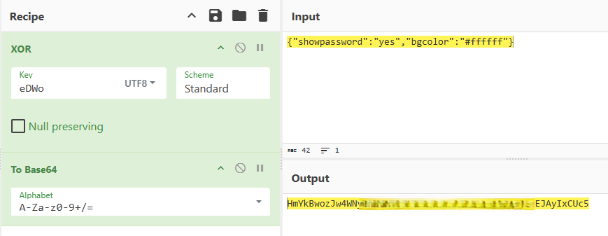
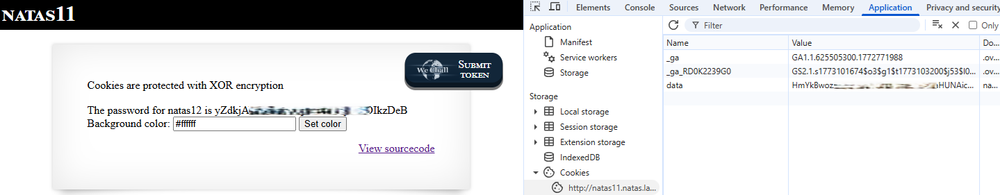

# Natas Level 11 → Level 12

## Level Goal / Objective

Find the password for the next level.

🔗 https://overthewire.org/wargames/natas/natas11.html

## Tools You May Need

```text
Browser DevTools, CyberChef
```

## Concept Focus

* XOR-based cookie manipulation
* Weak custom encryption
* Trusting client-side state

## Approach

### 1. Access the Level

Navigate to:

```text
http://natas11.natas.labs.overthewire.org/
```

Authenticate using:

```text
Username: natas11
Password: <previous level password>
```

---

### 2. Initial Enumeration

Viewing the source code shows that the application stores state in a `data` cookie and protects it using a custom XOR routine.

The default data structure includes:

```php
$defaultdata = array( "showpassword"=>"no", "bgcolor"=>"#ffffff");
```

The source also reveals that cookie data is:

- JSON encoded
- XOR encrypted
- Base64 encoded

This indicates the password display is controlled by the `showpassword` field.

---

### 3. Investigate Further

The goal is to change:

```json
{"showpassword":"no","bgcolor":"#ffffff"}
```

to:

```json
{"showpassword":"yes","bgcolor":"#ffffff"}
```

Using CyberChef and the existing cookie value, derive the repeating XOR keystream from the known plaintext structure.

Recovered keystream:

```text
eDWo
```

---

### 4. Forge a New Cookie

Create a new payload with `showpassword` set to `yes`, then reproduce the application logic:

1. XOR the JSON string using the recovered key `eDWo`
2. Base64 encode the result

Replace the value of the `data` cookie with the forged value in browser developer tools.

---

### 5. Extract the Password

Refresh the page after replacing the cookie.

The application trusts the modified cookie and reveals the password for the next level.

---

## Walkthrough (Screenshots)









---

## Password for Level 12

```text
yZdkjAYZRd3R... (redacted)
```

---

## Key Takeaways

* Custom cryptography is often insecure and easy to reverse
* Client-side state should never be trusted for authorization decisions
* Known plaintext can be used to recover XOR keystreams
* Encoding is not encryption, and weak encryption does not provide real security
