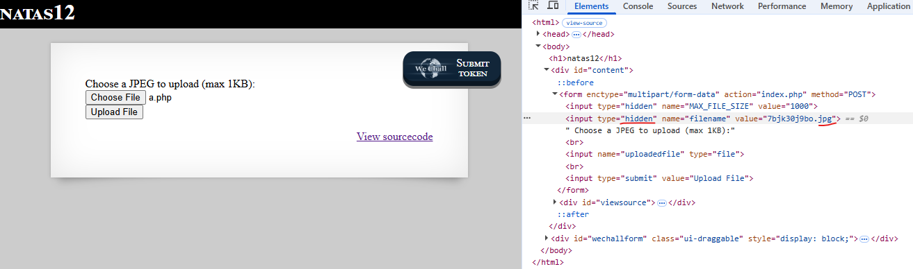
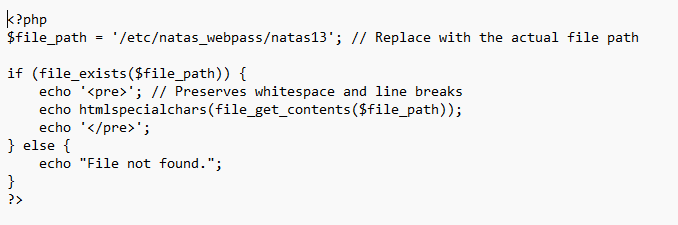
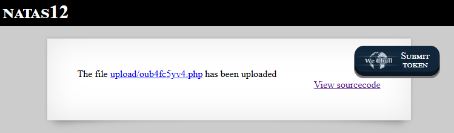
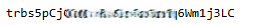

# Natas Level 12 → Level 13

## Level Goal / Objective

Find the password for the next level.

🔗 https://overthewire.org/wargames/natas/natas12.html

## Tools You May Need

```text
Browser DevTools, file upload testing
```

## Concept Focus

* Unrestricted file upload
* Client-side validation bypass
* Server-side code execution

## Approach

### 1. Access the Level

Navigate to:

```text
http://natas12.natas.labs.overthewire.org/
```

Authenticate using:

```text
Username: natas12
Password: <previous level password>
```

---

### 2. Initial Enumeration

Reviewing the source code shows a file upload form that appears to expect a JPEG file.

Inspecting the page reveals a hidden filename field that controls the server-side output filename.

---

### 3. Investigate Further

Using browser developer tools, modify the hidden filename field so the uploaded file uses a `.php` extension instead of `.jpg`.

This allows a PHP file to be uploaded with a server-executable extension.

---

### 4. Prepare the Upload

Create a small PHP file that reads the next password file and prints the contents.

Upload the crafted file after changing the hidden filename parameter.

---

### 5. Extract the Password

After upload, open the generated file URL shown by the application.

The uploaded PHP file executes on the server and returns the password for the next level.

---

## Walkthrough (Screenshots)









---

## Password for Level 13

```text
trbs5pCjCrku... (redacted)
```

---

## Key Takeaways

* Client-side restrictions on file types are not a security control
* Hidden form fields should never be trusted
* File upload functionality must validate content and extensions server-side
* Executable uploads can lead directly to remote code execution
