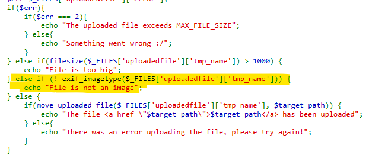
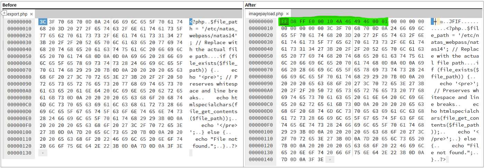
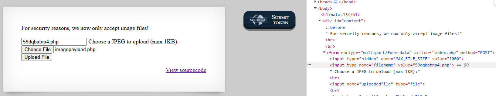
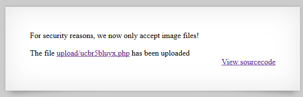
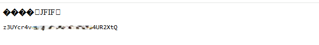

# Natas Level 13 → Level 14

## Level Goal / Objective

Find the password for the next level.

🔗 https://overthewire.org/wargames/natas/natas13.html

## Tools You May Need

```text
Browser DevTools, hex editor
```

## Concept Focus

* File upload bypass
* Magic bytes manipulation
* Server-side file validation weaknesses

## Approach

### 1. Access the Level

Navigate to:

```text
http://natas13.natas.labs.overthewire.org/
```

Authenticate using:

```text
Username: natas13
Password: <previous level password>
```

---

### 2. Initial Enumeration

Reviewing the source code shows the upload restrictions:

- File must be ≤ 1KB  
- File must be a valid image (checked using `exif_imagetype()`)

---

### 3. Investigate Further

Initial attempts:

- Renaming `.php` → `.jpg` → ❌ detected as invalid image  
- Using double extension `.php.jpg` → ❌ still detected  

The validation relies on **magic bytes** in the file header.

---

### 4. Craft the Payload

Modify the PHP payload file using a hex editor:

- Prepend valid JPEG magic bytes to the file header
- Keep the PHP payload intact after the header

This causes the file to pass `exif_imagetype()` validation.

---

### 5. Upload and Execute

- Modify the hidden filename field to ensure `.php` extension
- Upload the crafted file
- Retrieve the uploaded file path

Access the uploaded file URL to execute the payload.

---

### 6. Extract the Password

The executed payload reads:

```text
/etc/natas_webpass/natas14
```

and returns the password for the next level.

---

## Walkthrough (Screenshots)











---

## Password for Level 14

```text
z3UYcr4v... (redacted)
```

---

## Key Takeaways

* File type validation using magic bytes can be bypassed
* Renaming extensions alone is insufficient for secure validation
* File uploads must validate both content and execution context
* Improper upload handling can lead to remote code execution
