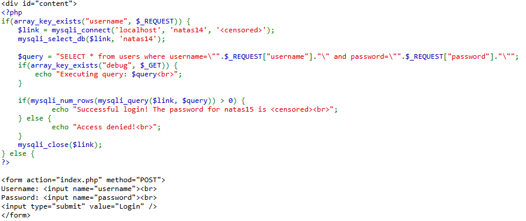
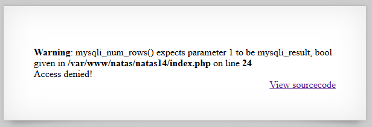
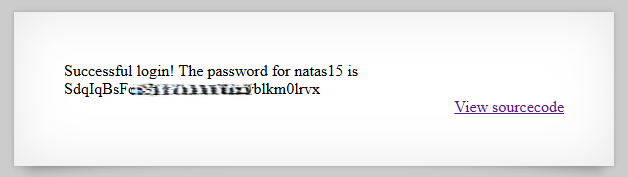

# Natas Level 14 → Level 15

## Level Goal / Objective

Find the password for the next level.

🔗 https://overthewire.org/wargames/natas/natas14.html

## Tools You May Need

```text
Browser DevTools, SQL injection
```

## Concept Focus

* SQL Injection
* Authentication bypass
* Unsanitized database queries

## Approach

### 1. Access the Level

Navigate to:

```text
http://natas14.natas.labs.overthewire.org/
```

Authenticate using:

```text
Username: natas14
Password: <previous level password>
```

---

### 2. Initial Enumeration

Viewing the source code reveals a SQL query constructed using user input:

```php
$query = "SELECT * from users where username="".$_REQUEST["username"]."" and password="".$_REQUEST["password"].""";
```

User input is directly embedded into the query without sanitization.

---

### 3. Investigate Further

Testing special characters (e.g. `"` ) causes errors, confirming:

- The backend is using MySQL
- Input is not properly escaped

---

### 4. Extract the Password

Use a classic SQL injection payload to bypass authentication:

```text
" OR 1=1 -- -
```

This modifies the query logic to always evaluate as true, allowing login without valid credentials.

The application then reveals the password for the next level.

---

## Walkthrough (Screenshots)







---

## Password for Level 15

```text
SdqIqBs... (redacted)
```

---

## Key Takeaways

* Directly embedding user input into SQL queries leads to injection vulnerabilities
* Authentication logic can be bypassed with simple boolean conditions
* Input sanitization and prepared statements are critical for secure database interactions
