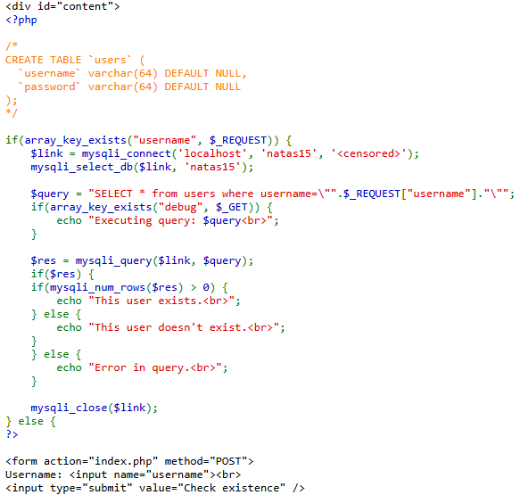
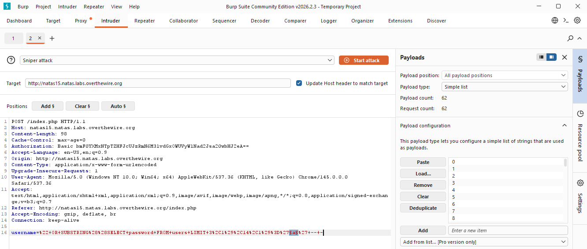
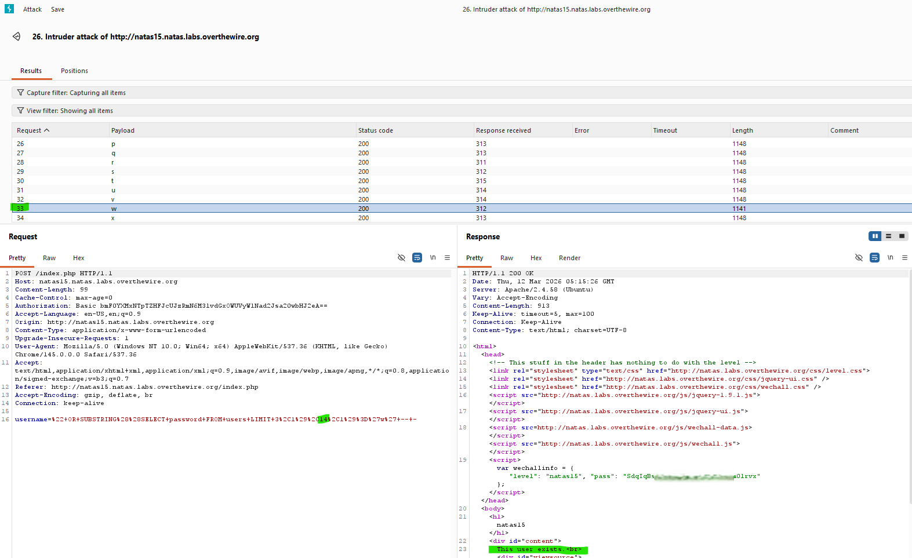

# Natas Level 15 → Level 16

## Level Goal / Objective

Find the password for the next level.

🔗 https://overthewire.org/wargames/natas/natas15.html

## Tools You May Need

```text
Browser DevTools, Burp Suite
```

## Concept Focus

* Blind SQL Injection
* Boolean-based enumeration
* Data extraction via inference

## Approach

### 1. Access the Level

Navigate to:

```text
http://natas15.natas.labs.overthewire.org/
```

Authenticate using:

```text
Username: natas15
Password: <previous level password>
```

---

### 2. Initial Enumeration

Source code reveals a SQL query but no direct output of query results:

```php
SELECT * from users where username="..." 
```

Responses differ based on query results:

- "This user exists." → TRUE  
- "This user doesn't exist." → FALSE  

---

### 3. Investigate Further

This creates a **boolean-based blind SQL injection** scenario.

We can test conditions character by character.

Example payload:

```text
" AND SUBSTRING((SELECT username FROM users LIMIT 1),1,1)='a' -- -
```

If TRUE → response confirms match.

---

### 4. Enumerate Data

Using Burp Suite (or manually), iterate through:

- Character positions
- ASCII values
- Table rows via `LIMIT`

Examples:

```text
" AND SUBSTRING((SELECT password FROM users LIMIT 1),1,1)='a' -- -
```

```text
" OR ASCII(SUBSTRING((SELECT password FROM users LIMIT 3,1),1,1))=65 -- -
```

This allows extraction of credentials character-by-character.

---

### 5. Extract the Password

By enumerating rows, identify the `natas16` user and reconstruct the password.

---

## Walkthrough (Screenshots)







---

## Password for Level 16

```text
hPkjKYviL... (redacted)
```

---

## Key Takeaways

* Blind SQL injection relies on inference rather than direct output
* Boolean responses can be used to extract sensitive data
* Enumeration can be automated, but manual methods still work
* ASCII-based testing helps handle case-sensitive values
