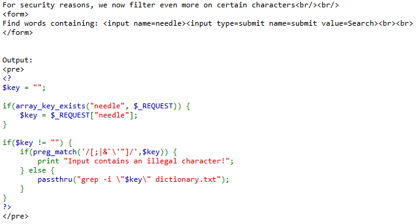
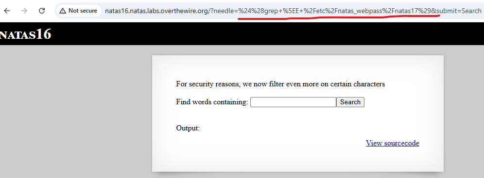
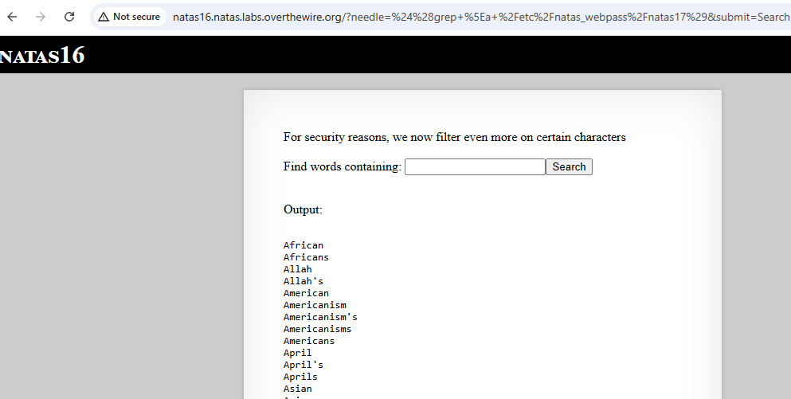
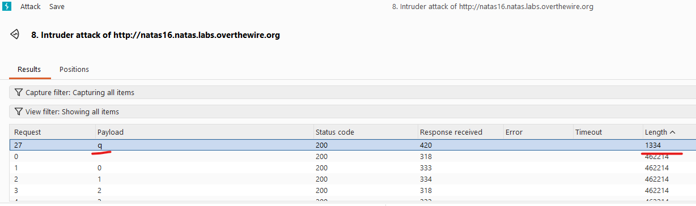

# Natas Level 16 → Level 17

## Level Goal / Objective

Find the password for the next level.

🔗 https://overthewire.org/wargames/natas/natas16.html

## Tools You May Need

```text
Browser DevTools, Burp Suite
```

## Concept Focus

* Blind command injection
* Input filtering bypass
* Boolean-based enumeration

## Approach

### 1. Access the Level

Navigate to:

```text
http://natas16.natas.labs.overthewire.org/
```

Authenticate using:

```text
Username: natas16
Password: <previous level password>
```

---

### 2. Initial Enumeration

Viewing the source code shows the application still uses `passthru()`, but with stricter input filtering:

```php
if($key != "") {
    if(preg_match('/[;|&`'"]/', $key)) {
        print "Input contains an illegal character!";
    } else {
        passthru("grep -i "$key" dictionary.txt");
    }
}
```

Direct command separators are blocked, but command substitution is still possible.

---

### 3. Investigate Further

Use command substitution to test whether a given character matches the start of the next password:

```text
$(grep ^a /etc/natas_webpass/natas17)
```

This creates a blind condition:

- If the test is successful, the page returns little or no output
- If the test fails, the normal dictionary output is returned

This allows character-by-character enumeration.

---

### 4. Enumerate the Password

Using Burp Suite Intruder, test characters from:

```text
a-z, A-Z, 0-9
```

and move from left to right through the password.

By checking which payload produces the distinct response, reconstruct the password one character at a time from:

```text
/etc/natas_webpass/natas17
```

---

### 5. Extract the Password

Continue the blind enumeration until the full password is recovered for the next level.

---

## Walkthrough (Screenshots)









---

## Password for Level 17

```text
EqjHJbo7... (redacted)
```

---

## Key Takeaways

* Blocking a few special characters does not eliminate command injection risk
* Command substitution can bypass naive input filters
* Response differences can be used for blind enumeration
* Burp Suite is effective for automating character-by-character inference attacks
